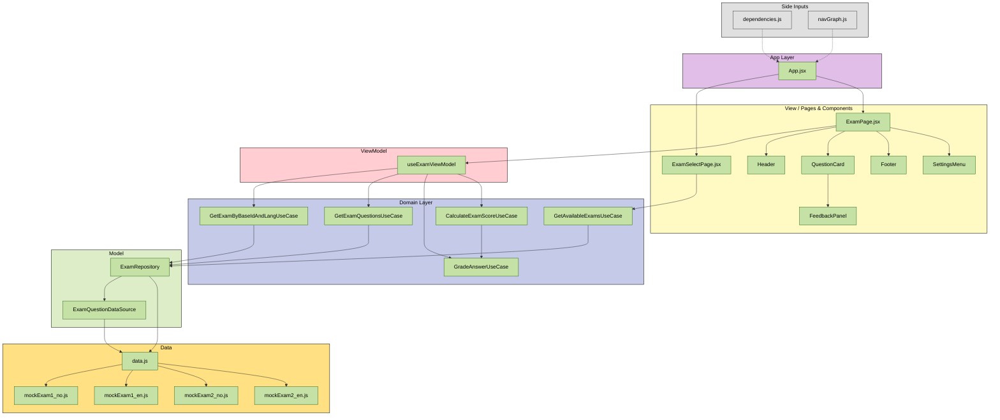

# IN5431 Exam Emulator

## Om prosjektet

Et **JavaScript, CSS, React og Vite**-prosjekt laget for å øve til skoleeksamen i **IN5431 – IT and Management**.

Prosjektet er en interaktiv eksamenssimulator der brukeren kan velge mellom flere øveeksamener, svare på spørsmål og få umiddelbar tilbakemelding etter levering.

Appen støtter flere spørsmålstyper:

1. Multiple choice med ett riktig svar
2. Multiple choice med flere riktige svar
3. Fyll inn riktig begrep

Etter levering får brukeren tilbakemelding på hvert spørsmål:

- Om svaret er riktig eller feil
- Hva fasiten er
- Kort forklaring på hvert svaralternativ
- Mulighet til å åpne svarkort for utvidet forklaring når `whyExtended` finnes i eksamensdataene
- Henvisning til pensum, forelesning eller fasitgrunnlag

Prosjektet er strukturert etter et MVVM-inspirert arkitekturmønster med tydelig lagdeling mellom data, datasource, repository, use cases, viewmodel, page og komponenter.

Målet med prosjektet er både å lage et nyttig eksamensverktøy og å demonstrere tydelig modularisering av en React-applikasjon.

---

## Sentrale funksjoner

| Funksjon | Beskrivelse |
|----------|-------------|
| Valg av eksamen | Brukeren kan velge mellom flere øveeksamener |
| Multiple choice | Støtter både ett riktig svar og flere riktige svar |
| Fyll inn begrep | Brukeren skriver inn riktig fagbegrep, med støtte for flere aksepterte svar |
| Automatisk retting | Svarene rettes når brukeren trykker «Lever og sjekk» |
| Fasit med forklaring | Viser hvorfor svaret er riktig eller galt |
| Utvidede forklaringer | Svarkort kan åpnes for å vise mer detaljert forklaring |
| Pensumhenvisning | Hvert spørsmål kan ha kilde/fasitlinje mot forelesning eller pensum |
| Poengscore | Viser antall poeng og prosent riktig |
| Feedback-visning | Brukeren kan vise eller skjule detaljert feedback etter levering |
| Ny runde | Eksamen kan nullstilles og tas på nytt |
| Språkvalg | Brukeren kan bytte mellom norsk og engelsk |
| Lys/mørk modus | Brukeren kan bytte mellom light mode og dark mode fra innstillinger |
| Responsivt grensesnitt | Layouten tilpasser seg skjermbredde |
| Moderne eksamenslayout | Bruker sidebar, progressbar, question cards og footer-navigasjon |
| Utvidbart eksamensregister | Nye øveeksamener kan legges til som egne datafiler |

---

## Prosjektstruktur

```bash
IN5431-Exam-Emulator/
├── README.md
├── index.html
├── package-lock.json
├── package.json
├── public/
├── vite.config.js
└── src/
    ├── App.jsx
    ├── main.jsx
    ├── constants/
    │   ├── QuestionConfig.js
    │   └── QuestionTypes.js
    ├── data/
    │   ├── data.js
    │   └── exams/
    │       ├── mockExam1_en.js
    │       ├── mockExam1_no.js
    │       ├── mockExam2_en.js
    │       └── mockExam2_no.js
    ├── di/
    │   └── dependencies.js
    ├── i18n/
    │   ├── LanguageContext.jsx
    │   └── translations.js
    ├── model/
    │   ├── datasource/
    │   │   └── ExamQuestionDataSource.js
    │   ├── domain/
    │   │   ├── CalculateExamScoreUseCase.js
    │   │   ├── GetAvailableExamsUseCase.js
    │   │   ├── GetExamByBaseIdAndLangUseCase.js
    │   │   ├── GetExamQuestionsUseCase.js
    │   │   └── GradeAnswerUseCase.js
    │   └── repositories/
    │       └── ExamRepository.js
    ├── navigation/
    │   └── navGraph.js
    ├── ui/
    │   ├── style/
    │   │   ├── App.css
    │   │   ├── Tokens.css
    │   │   ├── Global.css
    │   │   ├── Responsive.css
    │   │   ├── ExamPage/
    │   │   │   └── ...
    │   │   ├── ExamSelectPage/
    │   │   │   └── ...
    │   │   ├── Header/
    │   │   │   └── ...
    │   │   ├── Footer/
    │   │   │   └── ...
    │   │   ├── QuestionCard/
    │   │   │   └── ...
    │   │   ├── FeedbackPanel/
    │   │   │   └── ...
    │   │   ├── SettingsMenu/
    │   │   │   └── ...
    │   │   ├── Sidebar/
    │   │   │   └── ...
    │   │   └── ResultBadge/
    │   │       └── ...
    │   ├── theme/
    │   │   └── ThemeContext.jsx
    │   ├── view/
    │   │   ├── pages/
    │   │   │   ├── ExamPage.jsx
    │   │   │   └── ExamSelectPage.jsx
    │   │   └── components/
    │   │       ├── ExamSelectPage/
    │   │       │   ├── ExamSelectCard.jsx
    │   │       │   ├── ExamSelectGrid.jsx
    │   │       │   ├── ExamSelectIntro.jsx
    │   │       │   └── ExamSelectTopbar.jsx
    │   │       ├── Sidebar/
    │   │       │   ├── AppSidebar.jsx
    │   │       │   ├── SidebarBrand.jsx
    │   │       │   ├── SidebarCloseButton.jsx
    │   │       │   ├── SidebarMenuButton.jsx
    │   │       │   ├── SidebarNavigation.jsx
    │   │       │   ├── SidebarSettingsButton.jsx
    │   │       │   └── SidebarUserCard.jsx
    │   │       ├── Header/
    │   │       │   ├── Header.jsx
    │   │       │   ├── HeaderActions.jsx
    │   │       │   ├── HeaderButtons.jsx
    │   │       │   ├── StatCard.jsx
    │   │       │   └── SubmittedActions.jsx
    │   │       ├── Footer/
    │   │       │   ├── Footer.jsx
    │   │       │   └── FooterNavigationButton.jsx
    │   │       ├── Settings/
    │   │       │   └── SettingsMenu.jsx
    │   │       └── ExamPage/
    │   │           ├── FeedbackPanel.jsx
    │   │           ├── QuestionCard.jsx
    │   │           ├── ResultBadge.jsx
    │   │           └── QuestionCard/
    │   │               ├── AnswerCard/
    │   │               │   └── ...
    │   │               ├── Feedback/
    │   │               │   └── ...
    │   │               ├── Header/
    │   │               │   └── ...
    │   │               ├── InputField/
    │   │               │   └── ...
    │   │               ├── Options/
    │   │               │   └── ...
    │   │               ├── Prompt/
    │   │               │   └── ...
    │   │               └── Styling/
    │   │                   └── ...
    │   └── viewmodel/
    │       └── useExamViewModel.js
    └── utils/
        ├── answerutils/
        │   └── ...
        ├── questionutils/
        │   └── ...
        └── viewmodelutils/
            └── ...
```

---

## Eksamensdata

Eksamensinnholdet er delt opp i flere egne filer under `src/data/exams/`.

Hver eksamen eksporterer et objekt med metadata og spørsmål:

```js
export const mockExam1No = {
  id: "mock-exam-1-no",
  baseId: "mock-exam-1",
  lang: "no",
  title: "Øveeksamen 1: Full repetisjon",
  description: "CIO toolbox, D4D, IT governance, strategy og sustainability.",
  questions: [
    {
      id: 1,
      type: "single",
      title: "Business process",
      prompt: "Hva beskriver best en business process?",
      options: [
        {
          text: "En koordinert samling aktiviteter som skaper verdi.",
          correct: true,
          why: "Riktig: En business process beskriver hvordan arbeid utføres for å skape verdi.",
          whyExtended: [
            "En prosess består vanligvis av flere aktiviteter som henger sammen.",
            "Prosesser går ofte på tvers av avdelinger og roller.",
            "Poenget er å beskrive flyten fra input til output, ikke bare én isolert oppgave."
          ]
        },
        {
          text: "Kun en teknisk database.",
          correct: false,
          why: "Galt: En database kan støtte en prosess, men er ikke selve prosessen.",
          whyExtended: [
            "Teknologi kan være en del av prosessen, men prosessen handler om arbeid og verdiskaping.",
            "En database beskriver lagring av data, ikke nødvendigvis flyt, roller eller aktiviteter."
          ]
        }
      ]
    }
  ]
};
```

Alle eksamener samles i `src/data/data.js`. Tanken med dette er å gjøre det enkelt å legge til nye øveeksamener og språkversjoner uten å endre UI-komponentene.

### Spørsmålstyper

| Type | Beskrivelse |
|------|-------------|
| `single` | Multiple choice med ett riktig svar |
| `multi` | Multiple choice med flere riktige svar |
| `fill` | Fyll inn riktig fagbegrep |

### Forklaringsfelter

| Felt | Bruk |
|------|-----|
| `why` | Kort forklaring som vises direkte på svarkortet etter levering |
| `whyExtended` | Valgfri liste med utvidede forklaringspunkter som vises når svarkortet åpnes |
| `source` | Valgfri kildehenvisning mot forelesning, pensum eller fasitgrunnlag |

Hvis `whyExtended` mangler, vises ikke utvidet forklaring for det alternativet.

---

## Arkitektur

Prosjektet følger et lagdelt mønster inspirert av MVVM og Clean Architecture.



### Arkitekturflyt

```text
mockExam-filer
  ↓
data.js
  ↓
ExamQuestionDataSource
  ↓
ExamRepository
  ↓
UseCases
  ↓
useExamViewModel
  ↓
ExamPage
  ↓
UI Components
```

---

## Lagdeling

| Lag | Filer | Ansvar |
|-----|-------|--------|
| **Data** | `src/data/data.js`, `src/data/exams/*.js` | Inneholder eksamensregister og alle øveeksamener |
| **DataSource** | `ExamQuestionDataSource.js` | Henter eksamensdata og spørsmål fra lokal datakilde |
| **Repository** | `ExamRepository.js` | Gir domenelaget tilgang til eksamener og spørsmål uten at domenet kjenner datakilden |
| **Domain / UseCases** | `GetAvailableExamsUseCase`, `GetExamByBaseIdAndLangUseCase`, `GetExamQuestionsUseCase`, `GradeAnswerUseCase`, `CalculateExamScoreUseCase` | Inneholder appens sentrale regler |
| **ViewModel** | `useExamViewModel.js` | Holder React-state, brukerens svar, leveringstilstand, feedback-visning, åpne/lukkede svarkort, timer, navigasjon mellom spørsmål og score |
| **View / Page** | `ExamPage.jsx`, `ExamSelectPage.jsx` | Setter sammen sidene og sender props videre til komponentene |
| **Components** | `Header`, `QuestionCard`, `FeedbackPanel`, `Footer`, `SettingsMenu`, `ResultBadge` | Rene UI-komponenter som viser data og sender brukerhandlinger oppover |
| **i18n** | `LanguageContext.jsx`, `translations.js` | Håndterer språkvalg og tekstnøkler |
| **Theme** | `ThemeContext.jsx` | Håndterer light mode og dark mode |
| **Utils** | `answerutils`, `questionutils`, `viewmodelutils` | Hjelpefunksjoner for svar, spørsmålspresentasjon, labels og visningslogikk |
| **Constants** | `QuestionConfig.js`, `QuestionTypes.js` | Globale spørsmålsverdier og spørsmålstyper |

---

## Kjøring

Forutsetninger:

- Node.js installert
- npm installert

Installer avhengigheter:

```bash
npm install
```

Start utviklingsserver:

```bash
npm run dev
```

Bygg produksjonsversjon:

```bash
npm run build
```

Forhåndsvis produksjonsbygget:

```bash
npm run preview
```

---

## Designvalg

**Eksamensdata er delt opp i flere filer.**  
Hver øveeksamen og språkversjon ligger i egen fil under `src/data/exams/`. `data.js` fungerer som samlet eksamensregister.

**Hver eksamen har egen metadata.**  
Hver øveeksamen har en unik `id`, en `baseId`, et språkfelt, en `title`, en `description` og en liste med `questions`. Dette gjør at appen kan vise riktig eksamen basert på både valgt eksamen og valgt språk.

**Rette-logikken ligger i domenelaget.**  
`GradeAnswerUseCase` avgjør om et svar er riktig. Dette gjør at komponentene ikke trenger å kjenne reglene for single choice, multiple choice eller fill-in.

**Score beregnes i en egen use case.**  
`CalculateExamScoreUseCase` gjør poengberegning separat fra både UI og datalagring.

**ViewModel samler React-state.**  
`useExamViewModel` håndterer brukerens svar, submitted-status, feedback-visning, åpne/lukkede svarkort, loading, timer, score og navigasjon mellom spørsmål. Dermed holdes side- og komponentlaget enklere.

**UI-komponentene er mest mulig dumme.**  
Komponentene får data og handlers via props. State og brukerflyt eies primært av viewModelen, slik at komponentene i hovedsak fokuserer på presentasjon.

**QuestionCard er delt i funksjonelle underområder.**  
`QuestionCard` består av egne undermapper for `Header`, `Prompt`, `InputField`, `Options`, `AnswerCard`, `Feedback` og `Styling`. Dette gjør det lettere å finne riktig subkomponent og videreutvikle kortet uten at én fil får for mye ansvar.

**UI-et er delt inn i tydelige visuelle soner.**  
Eksamenssiden består av en sidebar, header/statistikk, progressbar, question card og footer-navigasjon. Dette gjør at brukeren hele tiden ser hvor langt de har kommet, hvilken oppgave de jobber med, og hvilke handlinger som er tilgjengelige.

**Språk og tema håndteres globalt.**  
Språkvalg håndteres gjennom `LanguageContext`, mens light/dark mode håndteres gjennom `ThemeContext`. Dette gjør at komponentene kan bruke felles tilstand uten å duplisere logikk.

**Styling er modulært organisert per UI-område.**  
`src/ui/style/App.css` fungerer som samlet CSS-entrypoint. Globale designverdier, global reset og responsiv grunnkonfigurasjon ligger i `Tokens.css`, `Global.css` og `Responsive.css`. Større UI-områder som `ExamPage`, `ExamSelectPage`, `Header`, `Footer`, `QuestionCard`, `FeedbackPanel`, `SettingsMenu` og `ResultBadge` har egne mapper med `index.css` og mindre CSS-moduler.

**Prosjektet bruker vanlig CSS og design tokens.**  
Tailwind er fjernet til fordel for vanlige CSS-filer, CSS custom properties og en tydelig modulstruktur. Farger, tekst, radius, skygger, overganger og tema defineres som globale design tokens.

**Composition Root i `dependencies.js`.**  
Alle datasource-, repository- og use case-instansene opprettes på ett sted. Det gjør appen mer ryddig og gjør det lettere å bytte implementasjoner senere.

---

## Teknologier

| Teknologi | Bruk |
|----------|------|
| JavaScript | Programmeringsspråk |
| React | UI-bibliotek |
| Vite | Byggverktøy og utviklingsserver |
| CSS | Modulær styling, layout, komponentstiler og dark mode |
| CSS custom properties | Globale design tokens for farger, radius, shadows, transitions og tema |
| lucide-react | Ikoner |

---

## Legge til en ny øveeksamen

For å legge til en ny øveeksamen:

1. Opprett nye filer i `src/data/exams/`, for eksempel `mockExam3_no.js` og `mockExam3_en.js`.
2. Eksporter eksamensobjekter med unik `id`.
3. Bruk samme `baseId` for språkversjonene.
4. Sett riktig språkfelt, for eksempel `lang: "no"` og `lang: "en"`.
5. Importer eksamenene i `src/data/data.js`.
6. Legg eksamenene inn i `EXAMS`-listen.

Eksempel:

```js
//src/data/exams/mockExam3_no.js
export const mockExam3No = {
  id: "mock-exam-3-no",
  baseId: "mock-exam-3",
  lang: "no",
  title: "Øveeksamen 3: Strategi og IT governance",
  description: "Repetisjon av strategy, governance, architecture og digital transformation.",
  questions: [
    {
      id: 1,
      type: "single",
      title: "Strategic positioning",
      prompt: "Hva kjennetegner strategic positioning?",
      source: "Porter: What Is Strategy?",
      options: [
        {
          text: "Å velge en unik posisjon og gjøre trade-offs.",
          correct: true,
          why: "Riktig: Strategi handler om valg, trade-offs og en unik posisjon.",
          whyExtended: [
            "Strategisk posisjonering handler ikke bare om å være effektiv.",
            "Virksomheten må velge hva den ikke skal gjøre.",
            "Trade-offs gjør strategien vanskeligere å kopiere."
          ]
        },
        {
          text: "Å gjøre de samme aktivitetene som konkurrentene, bare raskere.",
          correct: false,
          why: "Galt: Dette beskriver mer operational effectiveness enn strategi.",
          whyExtended: [
            "Operational effectiveness kan være nødvendig, men er ikke nok for en varig strategi.",
            "Hvis alle gjør det samme, blir forskjellene mellom aktørene mindre."
          ]
        }
      ]
    }
  ]
};
```

Deretter registreres eksamenen i `data.js`:

```js
import { mockExam1No } from "./exams/mockExam1_no.js";
import { mockExam1En } from "./exams/mockExam1_en.js";
import { mockExam2No } from "./exams/mockExam2_no.js";
import { mockExam2En } from "./exams/mockExam2_en.js";
import { mockExam3No } from "./exams/mockExam3_no.js";
import { mockExam3En } from "./exams/mockExam3_en.js";

export const EXAMS = [
  mockExam1No,
  mockExam1En,
  mockExam2No,
  mockExam2En,
  mockExam3No,
  mockExam3En
];
```

Alle eksamener må ha unik `id`. Språkversjoner av samme eksamen bør dele samme `baseId`.

---

## Legge til eller endre styling

Global styling importeres fra `src/ui/style/App.css`.

```css
/* src/ui/style/App.css */

@import "./Tokens.css";
@import "./Global.css";
@import "./Responsive.css";

@import "./ExamSelectPage/index.css";
@import "./ExamPage/index.css";

@import "./Header/index.css";
@import "./Footer/index.css";
@import "./QuestionCard/index.css";
@import "./FeedbackPanel/index.css";
@import "./SettingsMenu/index.css";
@import "./ResultBadge/index.css";
```

Retningslinjer:

- Globale designverdier legges i `Tokens.css`.
- Global reset og basisregler legges i `Global.css`.
- Globale responsive regler legges i `Responsive.css`.
- Side-spesifikk styling legges i mappen for siden, for eksempel `ExamPage/`.
- Komponentområde-spesifikk styling legges i mappen for komponentområdet, for eksempel `QuestionCard/`.
- Hver mappe bør ha en `index.css` som importerer del-filene i riktig rekkefølge.

---

## Videre arbeid

Mulige forbedringer:

- Legge til flere øveeksamener fra pensum
- Lage egne eksamener per tema, for eksempel CIO Toolbox, D4D, strategi, IT governance og bærekraft
- Legge til vanskelighetsgrad per spørsmål
- Legge til kategorier eller tags per spørsmål
- Fylle ut `whyExtended` i alle språkversjoner
- Lagre valgt eksamen og progresjon i localStorage
- Lage eksamensmodus med tilfeldig rekkefølge
- Lage statistikk over hvilke temaer brukeren ofte svarer feil på
- Legge til tester for `GradeAnswerUseCase` og `CalculateExamScoreUseCase`
- Legge til tester for henting av riktig eksamen basert på `examId`, `baseId` og språk
- Legge til komponenttester for `QuestionCard`, `AnswerOptionCard` og `FeedbackPanel`
- Hente spørsmål fra ekstern JSON-fil eller API

---

## Pensumgrunnlag

Øveeksamenene er basert på sentrale temaer i IN5431, blant annet:

| Tema | Eksempler |
|------|-----------|
| CIO Toolbox | Business case, alternative analysis, design thinking, projects, product teams og IT governance |
| Strategy | Operational effectiveness, strategic positioning, trade-offs og activity systems |
| IT Architecture | Business processes, operating model, BPMN, TOGAF og Fowler-perspektivet |
| Designed for Digital | Operational Backbone, Shared Customer Insights, Digital Platform, Accountability Framework og External Developer Platform |
| Digital strategy | Digital resources, digital initiatives, roadmap og ansvar |
| Sustainability | Digital teknologi, bærekraftstransisjoner, IKT-konsekvenser og rapportering |

---

## Kort oppsummert

Dette prosjektet er en strukturert React-applikasjon for eksamenstrening i IN5431.

Det viktigste læringspoenget er todelt:

1. Øve på pensumbegreper gjennom aktiv testing og forklarende fasit
2. Øve på modularisering av React-kode og CSS med tydelig ansvarsdeling
