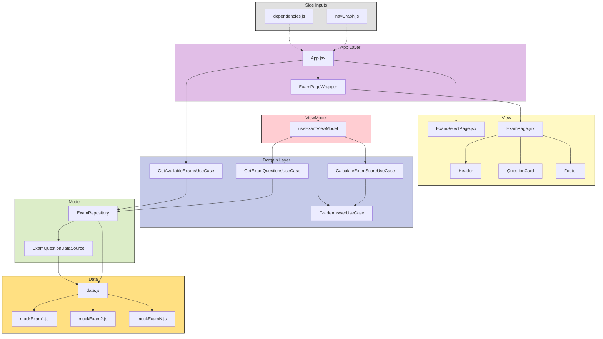

# IN5431 Exam Emulator

## Om prosjektet

Et **JavaScript, React, Vite og Tailwind CSS**-prosjekt laget for å øve til skoleeksamen i **IN5431 – IT and Management**.

Prosjektet er en interaktiv eksamenssimulator der brukeren kan velge mellom flere øveeksamener og få umiddelbar tilbakemelding etter levering.

Appen støtter flere spørsmålstyper:

1. Multiple choice med ett riktig svar
2. Multiple choice med flere riktige svar
3. Fyll inn riktig begrep

Etter levering får brukeren tilbakemelding på hvert spørsmål:

- Om svaret er riktig eller feil
- Hva fasiten er
- Hvorfor riktig alternativ er riktig
- Hvorfor gale alternativer er gale
- Henvisning til pensum, forelesning eller fasitgrunnlag

Prosjektet er strukturert etter MVVM-arkitekturmønsteret med tydelig lagdeling mellom data, datasource, repository, use cases, viewmodel, page og komponenter.

Målet med prosjektet er både å lage et nyttig eksamensverktøy og å demonstrere tydelig modularisering av en React-applikasjon.

---

## Sentrale funksjoner

| Funksjon | Beskrivelse |
|----------|-------------|
| Valg av eksamen | Brukeren kan velge mellom flere øveeksamener |
| Multiple choice | Støtter både ett riktig svar og flere riktige svar |
| Fyll inn begrep | Brukeren skriver inn riktig fagbegrep, med støtte for flere aksepterte svar |
| Automatisk retting | Svarene rettes når brukeren trykker «Lever og sjekk» |
| Fasit med forklaring | Viser hvorfor svaret er riktig eller galt |
| Pensumhenvisning | Hvert spørsmål har kilde/fasitlinje mot forelesning eller pensum |
| Poengscore | Viser antall poeng og prosent riktig |
| Filtrering | Etter levering kan brukeren filtrere på alle, riktige eller gale svar |
| Ny runde | Eksamen kan nullstilles og tas på nytt |
| Utvidbart eksamensregister | Nye øveeksamener kan legges til som egne datafiler |

---

## Prosjektstruktur

```bash
IN5431-Exam-Emulator/
├── README.md
├── index.html
├── package.json
├── postcss.config.js
├── tailwind.config.js
└── src/
    ├── main.jsx
    ├── App.jsx
    ├── index.css
    ├── data/
    │   ├── data.js
    │   └── exams/
    │       ├── mockExam1.js
    │       ├── mockExam2.js
    │       └── mockExamN.js
    ├── di/
    │   └── dependencies.js
    ├── model/
    │   ├── datasource/
    │   │   └── ExamQuestionDataSource.js
    │   ├── repositories/
    │   │   └── ExamRepository.js
    │   └── domain/
    │       ├── GetExamQuestionsUseCase.js
    │       ├── GradeAnswerUseCase.js
    │       └── CalculateExamScoreUseCase.js
    ├── ui/
    │   ├── viewmodel/
    │   │   └── useExamViewModel.js
    │   └── view/
    │       ├── pages/
    │       │   └── ExamPage.jsx
    │       └── components/
    │           └── ExamPage/
    │               ├── ExamHeader.jsx
    │               ├── ExamInstructions.jsx
    │               ├── ExamSelector.jsx
    │               ├── QuestionCard.jsx
    │               ├── FeedbackPanel.jsx
    │               ├── ResultBadge.jsx
    │               └── ExamFooter.jsx
    └── utils/
        └── exam/
            └── answerUtils.js
```

---

## Eksamensdata

Eksamensinnholdet er delt opp i flere egne filer under `src/data/exams/`.

Hver eksamen eksporterer et objekt med metadata og spørsmål:

```js
export const mockExam1 = {
  id: "mock-exam-1",
  title: "Øveeksamen 1: Full repetisjon",
  description: "CIO toolbox, D4D, IT governance, strategy og sustainability.",
  questions: [
    {
      id: 1,
      type: "fill",
      title: "Business process",
      // ...
    },
  ],
};
```

Alle eksamener samles i `src/data/data.js`:

```js
import { mockExam1 } from "./exams/mockExam1.js";
import { mockExam2 } from "./exams/mockExam2.js";
import { mockExamN } from "./exams/mockExamN.js";

export const DEFAULT_EXAM_ID = "mock-exam-1";

export const EXAMS = [
  mockExam1,
  mockExam2,
  mockExamN,
];

export function getExamById(examId) {
  return EXAMS.find((exam) => exam.id === examId) ?? EXAMS[0];
}

export function getExamQuestions(examId = DEFAULT_EXAM_ID) {
  return getExamById(examId).questions;
}
```

Dette gjør det enkelt å legge til nye øveeksamener uten å endre UI-komponentene.

---

## Arkitektur

Prosjektet følger et lagdelt mønster inspirert av MVVM og Clean Architecture.



### Arkitekturflyt

```text
mockExam-filer
  ↓
data.js
  ↓
ExamQuestionDataSource
  ↓
ExamRepository
  ↓
UseCases
  ↓
useExamViewModel
  ↓
ExamPage
  ↓
UI Components
```

---

## Lagdeling

| Lag | Filer | Ansvar |
|-----|-------|--------|
| **Data** | `src/data/data.js`, `src/data/exams/*.js` | Inneholder eksamensregister, standardeksamen og alle øveeksamener |
| **DataSource** | `ExamQuestionDataSource.js` | Henter eksamensdata og spørsmål fra lokal datakilde |
| **Repository** | `ExamRepository.js` | Gir domenelaget tilgang til eksamener og spørsmål uten at domenet kjenner datakilden |
| **Domain / UseCases** | `GetExamQuestionsUseCase`, `GradeAnswerUseCase`, `CalculateExamScoreUseCase` | Inneholder appens sentrale regler: hente spørsmål, rette svar og beregne score |
| **ViewModel** | `useExamViewModel.js` | Holder React-state, valgt eksamen, svar, leveringstilstand, filter og score |
| **View / Page** | `ExamPage.jsx` | Setter sammen siden og sender props videre til komponentene |
| **Components** | `ExamHeader`, `ExamSelector`, `QuestionCard`, `FeedbackPanel` osv. | Rene UI-komponenter som viser data og sender brukerhandlinger oppover |
| **Utils** | `answerUtils.js` | Hjelpefunksjoner for normalisering, fasitlabels og riktige indekser |

---

## Kjøring

Forutsetninger:

- Node.js installert
- npm installert

Installer avhengigheter:

```bash
npm install
```

Start utviklingsserver:

```bash
npm run dev
```

Bygg produksjonsversjon:

```bash
npm run build
```

Forhåndsvis produksjonsbygget:

```bash
npm run preview
```

---

## Designvalg

**Eksamensdata er delt opp i flere filer.**  
Hver øveeksamen ligger i en egen fil under `src/data/exams/`.  
`data.js` fungerer som et samlet eksamensregister som eksponerer `EXAMS`, `DEFAULT_EXAM_ID`, `getExamById` og `getExamQuestions`.

Dette gjør det enkelt å legge til, endre eller fjerne øveeksamener uten å endre UI-komponentene.

**Hver eksamen har egen metadata.**  
Hver øveeksamen har en unik `id`, en `title`, en `description` og en liste med `questions`. Dette gjør at appen kan vise riktig tittel, beskrivelse og spørsmål basert på valgt eksamen.

**Rette-logikken ligger i domenelaget.**  
`GradeAnswerUseCase` avgjør om et svar er riktig. Dette gjør at komponentene ikke trenger å kjenne reglene for single choice, multiple choice eller fill-in.

**Score beregnes i en egen use case.**  
`CalculateExamScoreUseCase` gjør poengberegning separat fra både UI og datalagring.

**ViewModel samler React-state.**  
`useExamViewModel` håndterer valgt eksamen, brukerens svar, submitted-status, filter, feedback-visning, loading og score. Dermed holdes `ExamPage.jsx` enklere.

**Komponentene er presentasjonsorienterte.**  
Komponentene viser data, men eier minst mulig forretningslogikk. Dette gjør dem lettere å lese, teste og bytte ut.

**Composition Root i `dependencies.js`.**  
Alle datasource-, repository- og use case-instansene opprettes på ett sted. Det gjør appen mer ryddig og gjør det lettere å bytte implementasjoner senere.

---

## Teknologier

| Teknologi | Bruk |
|----------|------|
| JavaScript | Programmeringsspråk |
| React | UI-bibliotek |
| Vite | Byggverktøy og utviklingsserver |
| Tailwind CSS | Styling |
| lucide-react | Ikoner |

---

## Sentrale filer

| Fil | Beskrivelse |
|-----|-------------|
| `src/data/data.js` | Samler alle tilgjengelige eksamener, setter standardeksamen og eksponerer hjelpefunksjoner for å hente eksamen/spørsmål |
| `src/data/exams/mockExam1.js` | Inneholder metadata, spørsmål, fasit, forklaringer og pensumhenvisninger for øveeksamen 1 |
| `src/data/exams/mockExam2.js` | Inneholder metadata, spørsmål, fasit, forklaringer og pensumhenvisninger for øveeksamen 2 |
| `src/di/dependencies.js` | Dependency injection / composition root |
| `src/model/datasource/ExamQuestionDataSource.js` | Henter eksamensdata fra lokal datakilde |
| `src/model/repositories/ExamRepository.js` | Gir domenelaget tilgang til eksamener og spørsmål |
| `src/model/domain/GetExamQuestionsUseCase.js` | Henter spørsmål for valgt eksamen |
| `src/model/domain/GradeAnswerUseCase.js` | Retter enkeltsvar |
| `src/model/domain/CalculateExamScoreUseCase.js` | Beregner score og prosent |
| `src/ui/viewmodel/useExamViewModel.js` | Holder eksamensstate og eksponerer actions til viewet |
| `src/ui/view/pages/ExamPage.jsx` | Hovedsiden for eksamen |
| `src/ui/view/components/ExamPage/ExamHeader.jsx` | Viser overskrift og overordnet informasjon om eksamen |
| `src/ui/view/components/ExamPage/ExamInstructions.jsx` | Viser instruksjoner før eller under eksamen |
| `src/ui/view/components/ExamPage/ExamSelector.jsx` | Lar brukeren velge mellom tilgjengelige øveeksamener |
| `src/ui/view/components/ExamPage/QuestionCard.jsx` | Viser ett spørsmål med input eller svaralternativer |
| `src/ui/view/components/ExamPage/FeedbackPanel.jsx` | Viser fasit og forklaring etter levering |
| `src/ui/view/components/ExamPage/ResultBadge.jsx` | Viser om et spørsmål er riktig eller feil |
| `src/ui/view/components/ExamPage/ExamFooter.jsx` | Viser handlinger som levering, filtrering eller ny runde |
| `src/utils/exam/answerUtils.js` | Hjelpefunksjoner for normalisering, fasitlabels og riktige indekser |

---

## Legge til en ny øveeksamen

For å legge til en ny øveeksamen:

1. Opprett en ny fil i `src/data/exams/`, for eksempel `mockExam3.js`.
2. Eksporter et eksamensobjekt med unik `id`.
3. Importer eksamenen i `src/data/data.js`.
4. Legg eksamenen inn i `EXAMS`-listen.

Eksempel:

```js
// src/data/exams/mockExam3.js

export const mockExam3 = {
  id: "mock-exam-3",
  title: "Øveeksamen 3: Strategi og IT governance",
  description: "Repetisjon av strategy, governance, architecture og digital transformation.",
  questions: [
    {
      id: 1,
      type: "single",
      title: "Strategic positioning",
      // ...
    },
  ],
};
```

Deretter registreres eksamenen i `data.js`:

```js
import { mockExam1 } from "./exams/mockExam1.js";
import { mockExam2 } from "./exams/mockExam2.js";
import { mockExam3 } from "./exams/mockExam3.js";

export const EXAMS = [
  mockExam1,
  mockExam2,
  mockExam3,
];
```

Alle eksamener må ha unik `id`.

---

## Videre arbeid

Mulige forbedringer:

- Legge til flere øveeksamener fra pensum
- Lage egne eksamener per tema, for eksempel CIO Toolbox, D4D, strategi, IT governance og bærekraft
- Legge til vanskelighetsgrad per spørsmål
- Legge til kategorier eller tags per spørsmål
- Lagre valgt eksamen og progresjon i localStorage
- Lage eksamensmodus med tilfeldig rekkefølge
- Lage statistikk over hvilke temaer brukeren ofte svarer feil på
- Legge til tester for `GradeAnswerUseCase` og `CalculateExamScoreUseCase`
- Legge til tester for henting av riktig eksamen basert på `examId`
- Hente spørsmål fra ekstern JSON-fil eller API

---

## Pensumgrunnlag

Øveeksamenene er basert på sentrale temaer i IN5431, blant annet:

| Tema | Eksempler |
|------|-----------|
| CIO Toolbox | Business case, alternative analysis, design thinking, projects, product teams og IT governance |
| Strategy | Operational effectiveness, strategic positioning, trade-offs og activity systems |
| IT Architecture | Business processes, operating model, BPMN, TOGAF og Fowler-perspektivet |
| Designed for Digital | Operational Backbone, Shared Customer Insights, Digital Platform, Accountability Framework og External Developer Platform |
| Digital strategy | Digital resources, digital initiatives, roadmap og ansvar |
| Sustainability | Digital teknologi, bærekraftstransisjoner, IKT-konsekvenser og rapportering |

---

## Kort oppsummert

Dette prosjektet er en strukturert React-applikasjon for eksamenstrening i IN5431.

Det viktigste læringspoenget er todelt:

1. Øve på pensumbegreper gjennom aktiv testing og forklarende fasit
2. Øve på modularisering av React-kode med tydelig ansvarsdeling

```text
Exam files → data.js → DataSource → Repository → UseCase → ViewModel → Page → Components
```