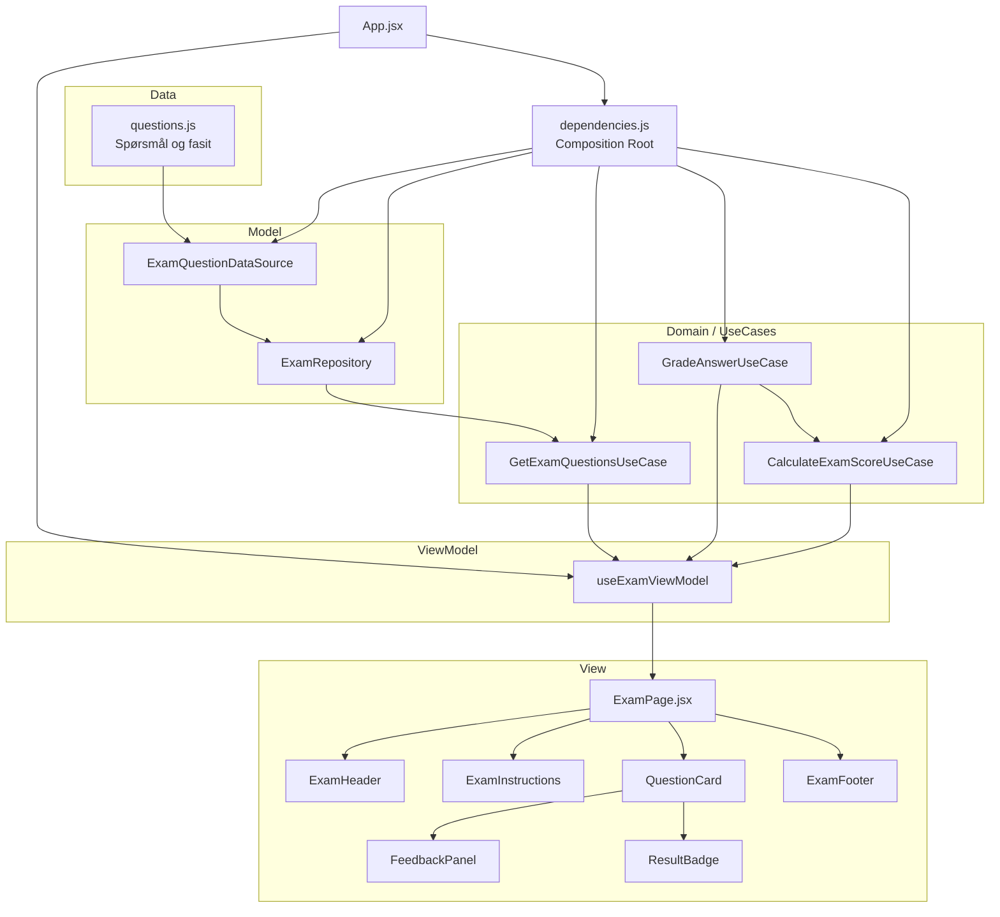

# IN5431 Exam Emulator

## Om prosjektet

Et **JavaScript, React, Vite og Tailwind CSS**-prosjekt laget for å øve til skoleeksamen i **IN5431 – IT and Management**.

Prosjektet er en interaktiv eksamens-emulator med spørsmålstyper som ligner en Inspera-style eksamen:

1. Multiple choice med ett riktig svar
2. Multiple choice med flere riktige svar
3. Fyll inn riktig begrep

Etter levering får brukeren umiddelbar tilbakemelding på hvert spørsmål:

- Om svaret er riktig eller feil
- Hva fasiten er
- Hvorfor riktig alternativ er riktig
- Hvorfor gale alternativer er gale
- Henvisning til pensum, forelesning eller fasitgrunnlag

Prosjektet er skrevet om etter samme arkitekturmønster som **Opplett-appen**, med tydelig lagdeling mellom datasource, repository, use cases, viewmodel, page og komponenter.

Målet med prosjektet er både å lage et nyttig eksamensverktøy og å øve på en mer ryddig frontend-arkitektur i React.

---

## Problemstilling

Hvordan kan man lage en enkel, modulær og utvidbar eksamens-emulator for IN5431 som gir studenten aktiv trening i pensumbegreper, samtidig som koden følger et ryddig arkitekturmønster?

Prosjektet forsøker å løse dette ved å kombinere:

- Pensumbaserte spørsmål
- Automatisk retting
- Forklarende fasit
- Poengberegning
- Filtrering på riktige og gale svar
- En MVVM / Clean Architecture-inspirert React-struktur

---

## Sentrale funksjoner

| Funksjon | Beskrivelse |
|----------|-------------|
| Multiple choice | Støtter både ett riktig svar og flere riktige svar |
| Fyll inn begrep | Brukeren skriver inn riktig fagbegrep, med støtte for flere aksepterte svar |
| Automatisk retting | Svarene rettes når brukeren trykker «Lever og sjekk» |
| Fasit med forklaring | Viser hvorfor svaret er riktig eller galt |
| Pensumhenvisning | Hvert spørsmål har kilde/fasitlinje mot forelesning eller pensum |
| Poengscore | Viser antall poeng og prosent riktig |
| Filtrering | Etter levering kan brukeren filtrere på alle, riktige eller gale svar |
| Ny runde | Eksamen kan nullstilles og tas på nytt |

---

## Prosjektstruktur

```bash
IN5431-Exam-Emulator/
├── README.md
├── index.html
├── package.json
├── postcss.config.js
├── tailwind.config.js
└── src/
    ├── main.jsx
    ├── App.jsx
    ├── index.css
    ├── data/
    │   └── questions.js
    ├── di/
    │   └── dependencies.js
    ├── model/
    │   ├── datasource/
    │   │   └── ExamQuestionDataSource.js
    │   ├── repositories/
    │   │   └── ExamRepository.js
    │   └── domain/
    │       ├── GetExamQuestionsUseCase.js
    │       ├── GradeAnswerUseCase.js
    │       └── CalculateExamScoreUseCase.js
    ├── ui/
    │   ├── viewmodel/
    │   │   └── useExamViewModel.js
    │   └── view/
    │       ├── pages/
    │       │   └── ExamPage.jsx
    │       └── components/
    │           └── ExamPage/
    │               ├── ExamHeader.jsx
    │               ├── ExamInstructions.jsx
    │               ├── QuestionCard.jsx
    │               ├── FeedbackPanel.jsx
    │               ├── ResultBadge.jsx
    │               └── ExamFooter.jsx
    └── utils/
        └── exam/
            └── answerUtils.js
```

---

## Arkitektur

Prosjektet følger et lagdelt mønster inspirert av MVVM og Clean Architecture.



### Arkitekturflyt

```text
questions.js
  ↓
ExamQuestionDataSource
  ↓
ExamRepository
  ↓
UseCases
  ↓
useExamViewModel
  ↓
ExamPage
  ↓
UI Components
```

---

## Lagdeling

| Lag | Filer | Ansvar |
|-----|-------|--------|
| **Data** | `src/data/questions.js` | Inneholder spørsmål, svaralternativer, fasit, forklaringer og kilder |
| **DataSource** | `ExamQuestionDataSource.js` | Henter spørsmål fra lokal datakilde |
| **Repository** | `ExamRepository.js` | Gir domenelaget tilgang til spørsmålene uten at domenet kjenner datakilden |
| **Domain / UseCases** | `GetExamQuestionsUseCase`, `GradeAnswerUseCase`, `CalculateExamScoreUseCase` | Inneholder appens sentrale regler: hente spørsmål, rette svar og beregne score |
| **ViewModel** | `useExamViewModel.js` | Holder React-state, bruker use cases og eksponerer data/actions til viewet |
| **View / Page** | `ExamPage.jsx` | Setter sammen siden og sender props videre til komponentene |
| **Components** | `ExamHeader`, `QuestionCard`, `FeedbackPanel` osv. | Rene UI-komponenter som viser data og sender brukerhandlinger oppover |
| **Utils** | `answerUtils.js` | Hjelpefunksjoner for normalisering, fasitlabels og riktige indekser |

---

## Kjøring

Forutsetninger:

- Node.js installert
- npm installert

Installer avhengigheter:

```bash
npm install
```

Start utviklingsserver:

```bash
npm run dev
```

Bygg produksjonsversjon:

```bash
npm run build
```

Forhåndsvis produksjonsbygget:

```bash
npm run preview
```

---

## Designvalg

**Spørsmålene ligger i én egen datafil.**  
`questions.js` inneholder selve eksamensinnholdet. Dette gjør det enkelt å legge til, endre eller fjerne spørsmål uten å endre UI-komponentene.

**Rette-logikken ligger i domenelaget.**  
`GradeAnswerUseCase` avgjør om et svar er riktig. Dette gjør at komponentene ikke trenger å kjenne reglene for single choice, multiple choice eller fill-in.

**Score beregnes i en egen use case.**  
`CalculateExamScoreUseCase` gjør poengberegning separat fra både UI og datalagring.

**ViewModel samler React-state.**  
`useExamViewModel` håndterer answers, submitted, filter, showAllFeedback og loading. Dermed holdes `ExamPage.jsx` enklere.

**Komponentene er presentasjonsorienterte.**  
Komponentene viser data, men eier minst mulig forretningslogikk. Dette gjør dem lettere å lese, teste og bytte ut.

**Composition Root i `dependencies.js`.**  
Alle datasource-, repository- og use case-instansene opprettes på ett sted. Det gjør appen mer ryddig og gjør det lettere å bytte implementasjoner senere.

---

## Teknologier

<table>
  <tbody>
    <tr>
      <td>1</td>
      <td>JavaScript</td>
    </tr>
    <tr>
      <td>2</td>
      <td>React</td>
    </tr>
    <tr>
      <td>3</td>
      <td>Vite</td>
    </tr>
    <tr>
      <td>4</td>
      <td>Tailwind CSS</td>
    </tr>
    <tr>
      <td>5</td>
      <td>lucide-react</td>
    </tr>
  </tbody>
</table>

---

## Sentrale filer

| Fil | Beskrivelse |
|-----|-------------|
| `src/data/questions.js` | Alle spørsmål, fasit, forklaringer og pensumhenvisninger |
| `src/di/dependencies.js` | Dependency injection / composition root |
| `src/model/domain/GradeAnswerUseCase.js` | Retter enkeltsvar |
| `src/model/domain/CalculateExamScoreUseCase.js` | Beregner score og prosent |
| `src/ui/viewmodel/useExamViewModel.js` | Holder eksamensstate og eksponerer actions |
| `src/ui/view/pages/ExamPage.jsx` | Hovedsiden for eksamen |
| `src/ui/view/components/ExamPage/QuestionCard.jsx` | Viser ett spørsmål med input/alternativer |
| `src/ui/view/components/ExamPage/FeedbackPanel.jsx` | Viser fasit og forklaring etter levering |

---

## Videre arbeid

Mulige forbedringer:

- Legge til flere spørsmål fra pensum
- Lage egne kategorier, for eksempel CIO Toolbox, D4D, strategi, IT governance og bærekraft
- Legge til vanskelighetsgrad per spørsmål
- Lagre progresjon i localStorage
- Lage eksamensmodus med tilfeldig rekkefølge
- Lage statistikk over hvilke temaer brukeren ofte svarer feil på
- Legge til tester for `GradeAnswerUseCase` og `CalculateExamScoreUseCase`
- Hente spørsmål fra ekstern JSON-fil eller API

---

## Pensumgrunnlag

Spørsmålene er basert på sentrale temaer i IN5431, blant annet:

| Tema | Eksempler |
|------|-----------|
| CIO Toolbox | Business case, alternative analysis, design thinking, projects, product teams og IT governance |
| Strategy | Operational effectiveness, strategic positioning, trade-offs og activity systems |
| IT Architecture | Business processes, operating model, BPMN, TOGAF og Fowler-perspektivet |
| Designed for Digital | Operational Backbone, Shared Customer Insights, Digital Platform, Accountability Framework og External Developer Platform |
| Digital strategy | Digital resources, digital initiatives, roadmap og ansvar |
| Sustainability | Digital teknologi, bærekraftstransisjoner, IKT-konsekvenser og rapportering |

---

## Kort oppsummert

Dette prosjektet er en liten, men strukturert React-applikasjon for eksamenstrening i IN5431.

Det viktigste læringspoenget er todelt:

1. Øve på pensumbegreper gjennom aktiv testing og forklarende fasit
2. Øve på modularisering av React-kode med tydelig ansvarsdeling

```text
DataSource → Repository → UseCase → ViewModel → Page → Components
```
