# IN5431 Exam Emulator

## Om prosjektet

Et **JavaScript, CSS, React og Vite**-prosjekt laget for å øve til skoleeksamen i **IN5431 – IT and Management**.

Prosjektet er en interaktiv eksamenssimulator der brukeren kan velge mellom flere øveeksamener, svare på spørsmål og få fasit med forklaring etter levering.

Appen støtter flere spørsmålstyper:

1. Multiple choice med ett riktig svar
2. Multiple choice med flere riktige svar
3. Fyll inn riktig begrep

Etter levering får brukeren tilbakemelding på hvert spørsmål:

- Om svaret er riktig eller feil
- Hva fasiten er
- Kort forklaring på hvert svaralternativ
- Hvilke radio-/checkbox-alternativer brukeren valgte
- Brukerens fill-in-svar og riktig svar side om side
- Mulighet til å åpne svarkort for utvidet forklaring når `whyExtended` finnes i eksamensdataene
- Henvisning til pensum, forelesning eller fasitgrunnlag

Prosjektet er strukturert etter et MVVM-inspirert arkitekturmønster med tydelig lagdeling mellom data, datasource, repository, use cases, viewmodel, page og komponenter.

Målet med prosjektet er både å lage et nyttig eksamensverktøy og å demonstrere tydelig modularisering av en React-applikasjon.

---

## Sentrale funksjoner

| Funksjon | Beskrivelse |
|----------|-------------|
| Valg av fag | Brukeren kan velge fag før eksamen velges |
| Valg av eksamen | Brukeren kan velge mellom flere øveeksamener |
| Multiple choice | Støtter både ett riktig svar og flere riktige svar |
| Fyll inn begrep | Brukeren skriver inn riktig fagbegrep, med støtte for flere aksepterte svar |
| Automatisk retting | Svarene rettes når brukeren trykker «Lever nå» |
| Fasit etter levering | Etter levering vises fasit, forklaringer og vurdering av svarene |
| Tydelig fill-in feedback | Fill-in-spørsmål viser brukerens svar og riktig svar side om side etter levering |
| Markering av valgt alternativ | I feedback-mode markeres brukerens valgte radio-/checkbox-alternativer tydelig |
| Utvidede forklaringer | Svarkort kan åpnes for å vise mer detaljert forklaring |
| Forbedret feedback-visning | Forklaringer og pensumhenvisninger vises som tydelige kort |
| Pensumhenvisning | Hvert spørsmål kan ha kilde/fasitlinje mot forelesning eller pensum |
| Poengscore | Viser antall poeng og prosent riktig |
| Ny runde | Eksamen kan nullstilles og tas på nytt |
| Språkvalg | Brukeren kan bytte mellom norsk og engelsk |
| Lys/mørk modus | Brukeren kan bytte mellom light mode og dark mode fra innstillinger |
| Felles sidebar | Samme sidebar brukes på tvers av hele appen |
| Hamburger/drawer på små skjermer | På smale skjermer åpnes sidebaren via hamburgermeny og kan lukkes med backdrop eller lukkeknapp |
| Responsivt grensesnitt | Layouten tilpasser seg skjermbredde og skjermhøyde |
| Laptop-optimalisert layout | ExamPage, SubjectSelectPage og ExamSelectPage har egne responsive regler for typiske laptop-skjermer og svært lave viewport-høyder |
| Moderne eksamenslayout | Bruker sidebar, header/statistikk, progressbar, question cards og footer-navigasjon |
| Lever nå-knapp | Siste spørsmål viser «Lever nå» i stedet for «Neste» i footer-navigasjonen |
| Resultatdots | Etter levering viser footer-dots grønn eller rød farge per spørsmål |
| Utvidbart eksamensregister | Nye øveeksamener kan legges til som egne datafiler |

---

## Prosjektstruktur

```bash
IN5431-Exam-Emulator/
├── README.md
├── index.html
├── package-lock.json
├── package.json
├── public/
├── test/
│   └── ...
├── vite.config.js
└── src/
    ├── App.jsx
    ├── main.jsx
    ├── constants/
    │   ├── QuestionConfig.js
    │   └── QuestionTypes.js
    ├── data/
    │   ├── data.js
    │   ├── subjects.js
    │   └── exams/
    │       ├── mockExam1_en.js
    │       ├── mockExam1_no.js
    │       ├── mockExam2_en.js
    │       ├── mockExam2_no.js
    │       ├── mockExam3_en.js
    │       └── mockExam3_no.js
    ├── di/
    │   └── dependencies.js
    ├── i18n/
    │   ├── LanguageContext.jsx
    │   └── translations.js
    ├── model/
    │   ├── datasource/
    │   │   └── ...
    │   ├── domain/
    │   │   └── ...
    │   └── repositories/
    │       └── ...
    ├── navigation/
    │   ├── navGraph.js
    │   └── navItems.js
    ├── ui/
    │   ├── style/
    │   │   ├── App.css
    │   │   ├── Tokens.css
    │   │   ├── Global.css
    │   │   ├── ExamPage/
    │   │   │   └── ...
    │   │   ├── ExamSelectPage/
    │   │   │   └── ...
    │   │   ├── SubjectSelectPage/
    │   │   │   └── ...
    │   │   ├── Header/
    │   │   │   └── ...
    │   │   ├── Footer/
    │   │   │   └── ...
    │   │   ├── QuestionCard/
    │   │   │   └── ...
    │   │   ├── FeedbackPanel/
    │   │   │   └── ...
    │   │   ├── SettingsMenu/
    │   │   │   └── ...
    │   │   ├── Sidebar/
    │   │   │   └── ...
    │   │   └── ResultBadge/
    │   │       └── ...
    │   ├── theme/
    │   │   └── ThemeContext.jsx
    │   ├── view/
    │   │   ├── pages/
    │   │   │   ├── ExamPage.jsx
    │   │   │   ├── ExamSelectPage.jsx
    │   │   │   └── SubjectSelectPage.jsx
    │   │   └── components/
    │   │       ├── ExamPage/
    │   │       │   └── ...
    │   │       ├── ExamSelectPage/
    │   │       │   └── ...
    │   │       ├── SubjectSelectPage/
    │   │       │   └── ...
    │   │       ├── Header/
    │   │       │   └── ...
    │   │       ├── Footer/
    │   │       │   └── ...
    │   │       ├── Settings/
    │   │       │   └── ...
    │   │       ├── Sidebar/
    │   │       │   └── ...
    │   │       └── SubjectIcon.jsx
    │   └── viewmodel/
    │       ├── AppNavigationViewModel.js
    │       ├── ExamPageViewModel.js
    │       ├── ExamSelectPageViewModel.js
    │       ├── PlaceholderPageViewModel.js
    │       └── SubjectSelectPageViewModel.js
    └── utils/
        ├── answerutils/
        │   └── ...
        ├── examPageUtils/
        │   └── ...
        ├── questionutils/
        │   └── ...
        └── viewmodelutils/
            └── ...
```
---

## Teststruktur

Testene ligger i en egen `test/`-mappe og er organisert etter samme lagdeling som resten av prosjektet.

```bash
test/
├── integration/
│   └── examFlow.integration.test.js
├── model/
│   ├── domain/
│   │   ├── CalculateExamScoreUseCase.test.js
│   │   ├── GetAvailableExamsUseCase.test.js
│   │   ├── GetAvailableSubjectsUseCase.test.js
│   │   ├── GetExamByBaseIdAndLangUseCase.test.js
│   │   ├── GetExamQuestionsUseCase.test.js
│   │   ├── GetSubjectByIdUseCase.test.js
│   │   └── GradeAnswerUseCase.test.js
│   └── repositories/
│       ├── ExamRepository.test.js
│       └── SubjectRepository.test.js
└── utils/
    ├── answerUtils.test.js
    ├── questionUtils.test.js
    └── viewModelUtils.test.js
```

Testmappene har følgende ansvar:

| Mappe | Ansvar |
|------|--------|
| `test/integration/` | Tester samlet eksamensflyt med ekte data fra prosjektet |
| `test/model/domain/` | Tester use cases og domenelogikk isolert |
| `test/model/repositories/` | Tester repository-laget og henting av fag/eksamensdata |
| `test/utils/` | Tester hjelpefunksjoner for svar, spørsmål og viewmodel-visning |

---

## Teststrategi

Teststrategien følger arkitekturen i prosjektet:

```text
Data
  ↓
Repository
  ↓
UseCases
  ↓
ViewModel / Utils
```

Målet er å teste mest mulig av forretningslogikken uten å måtte starte Vite eller åpne appen i nettleseren.

Testene dekker blant annet:

- retting av single choice-svar
- retting av multiple choice-svar
- retting av fill-in-svar
- beregning av score og prosent
- henting av fag
- henting av eksamener
- henting av spørsmål
- henting av riktig språkversjon av samme eksamen
- repository-logikk
- hjelpefunksjoner for svar, spørsmål og visning
- integrert eksamensflyt med ekte data

---

### Enhetstester

<table>
    <thead>
        <tr>
            <th>ID</th>
            <th>Test-case</th>
            <th>Testbetingelse</th>
            <th>Testdata / input</th>
            <th>Forventet resultat</th>
            <th>Testfil</th>
            <th>Risiko</th>
        </tr>
    </thead>
    <tbody>
        <tr>
            <td>UT-01</td>
            <td>Rette single choice-svar</td>
            <td>Systemet skal avgjøre om valgt alternativ er korrekt</td>
            <td>Spørsmål av typen <code>single</code> + valgt index</td>
            <td>Returnerer <code>true</code> for riktig alternativ og <code>false</code> for feil alternativ</td>
            <td><code>GradeAnswerUseCase.test.js</code></td>
            <td>Svært alvorlig</td>
        </tr>
        <tr>
            <td>UT-02</td>
            <td>Rette multiple choice-svar</td>
            <td>Systemet skal håndtere flere riktige alternativer</td>
            <td>Spørsmål av typen <code>multi</code> + liste med valgte indexer</td>
            <td>Returnerer <code>true</code> bare når alle og kun riktige alternativer er valgt</td>
            <td><code>GradeAnswerUseCase.test.js</code></td>
            <td>Svært alvorlig</td>
        </tr>
        <tr>
            <td>UT-03</td>
            <td>Rette fill-in-svar</td>
            <td>Systemet skal godta riktige tekstsvar og alternative svar</td>
            <td>Spørsmål av typen <code>fill</code> + tekstinput</td>
            <td>Returnerer <code>true</code> for godkjente svar og <code>false</code> for feil svar</td>
            <td><code>GradeAnswerUseCase.test.js</code> / <code>answerUtils.test.js</code></td>
            <td>Svært alvorlig</td>
        </tr>
        <tr>
            <td>UT-04</td>
            <td>Beregne eksamensscore</td>
            <td>Systemet skal beregne poengsum og prosent etter levering</td>
            <td>Liste med spørsmål + brukerens svar</td>
            <td>Returnerer korrekt <code>score</code>, <code>totalPoints</code> og <code>percentage</code></td>
            <td><code>CalculateExamScoreUseCase.test.js</code></td>
            <td>Svært alvorlig</td>
        </tr>
        <tr>
            <td>UT-05</td>
            <td>Hente tilgjengelige fag</td>
            <td>Systemet skal vise fag som kan velges i appen</td>
            <td><code>{ language: "no" }</code></td>
            <td>Returnerer fagliste med riktige fag, synlighet og eksamensteller</td>
            <td><code>GetAvailableSubjectsUseCase.test.js</code></td>
            <td>Alvorlig</td>
        </tr>
        <tr>
            <td>UT-06</td>
            <td>Hente fag basert på ID</td>
            <td>Systemet skal finne riktig fag når <code>subjectId</code> er valgt</td>
            <td><code>{ subjectId: "in5431", language: "en" }</code></td>
            <td>Returnerer riktig fag med kode, navn og <code>examCount</code></td>
            <td><code>GetSubjectByIdUseCase.test.js</code></td>
            <td>Alvorlig</td>
        </tr>
        <tr>
            <td>UT-07</td>
            <td>Hente tilgjengelige eksamener for fag og språk</td>
            <td>Systemet skal vise riktige eksamener for valgt fag og språk</td>
            <td><code>{ subjectId: "in5431", language: "no" }</code></td>
            <td>Returnerer riktige eksamener med riktig <code>id</code>, <code>lang</code> og spørsmålsteller</td>
            <td><code>GetAvailableExamsUseCase.test.js</code></td>
            <td>Svært alvorlig</td>
        </tr>
        <tr>
            <td>UT-08</td>
            <td>Hente spørsmål for valgt eksamen</td>
            <td>Systemet skal laste spørsmålene til valgt eksamen</td>
            <td><code>examId: "mock-exam-1-no"</code></td>
            <td>Returnerer riktig antall spørsmål og riktige spørsmålstyper</td>
            <td><code>GetExamQuestionsUseCase.test.js</code></td>
            <td>Svært alvorlig</td>
        </tr>
        <tr>
            <td>UT-09</td>
            <td>Hente språkversjon av samme eksamen</td>
            <td>Systemet skal kunne finne eksamen basert på <code>baseId</code> og <code>lang</code></td>
            <td><code>{ baseId: "mock-exam-1", lang: "en" }</code></td>
            <td>Returnerer eksamen med riktig <code>id</code>, samme <code>baseId</code> og riktig <code>lang</code></td>
            <td><code>GetExamByBaseIdAndLangUseCase.test.js</code></td>
            <td>Svært alvorlig</td>
        </tr>
        <tr>
            <td>UT-10</td>
            <td>Repository returnerer riktige eksamensdata</td>
            <td>Repository-laget skal hente eksamener og spørsmål fra datagrunnlaget</td>
            <td>Eksisterende og ikke-eksisterende <code>examId</code>, <code>baseId</code>, <code>lang</code></td>
            <td>Returnerer riktig eksamen/spørsmål, eller <code>null</code>/tom liste når data mangler</td>
            <td><code>ExamRepository.test.js</code></td>
            <td>Alvorlig</td>
        </tr>
        <tr>
            <td>UT-11</td>
            <td>Repository returnerer riktige fagdata</td>
            <td>Repository-laget skal hente fag og fagmetadata fra datagrunnlaget</td>
            <td>Eksisterende og ikke-eksisterende <code>subjectId</code></td>
            <td>Returnerer riktig fag eller <code>null</code> når fag ikke finnes</td>
            <td><code>SubjectRepository.test.js</code></td>
            <td>Alvorlig</td>
        </tr>
        <tr>
            <td>UT-12</td>
            <td>Hjelpefunksjoner for svarlogikk</td>
            <td>Utils skal tolke og normalisere svar likt på tvers av appen</td>
            <td>Tekstsvar, valgt index, valgte alternativer</td>
            <td>Returnerer riktig normalisert svar og riktig vurderingsgrunnlag</td>
            <td><code>answerUtils.test.js</code></td>
            <td>Alvorlig</td>
        </tr>
        <tr>
            <td>UT-13</td>
            <td>Hjelpefunksjoner for spørsmål</td>
            <td>Utils skal gi riktig presentasjonsdata for spørsmål</td>
            <td>Spørsmålsobjekter med ulike typer</td>
            <td>Returnerer riktige labels, verdier og visningsdata</td>
            <td><code>questionUtils.test.js</code></td>
            <td>Moderat</td>
        </tr>
        <tr>
            <td>UT-14</td>
            <td>Hjelpefunksjoner for ViewModel-visning</td>
            <td>Utils skal gi riktig UI-status basert på state</td>
            <td>Svarstatus, submitted-status og spørsmålsdata</td>
            <td>Returnerer riktige statusverdier og visningsflagg</td>
            <td><code>viewModelUtils.test.js</code></td>
            <td>Moderat</td>
        </tr>
    </tbody>
</table>

### Integrasjonstester

<table>
    <thead>
        <tr>
            <th>ID</th>
            <th>Test-case</th>
            <th>Testbetingelse</th>
            <th>Testdata / input</th>
            <th>Forventet resultat</th>
            <th>Testfil</th>
            <th>Risiko</th>
        </tr>
    </thead>
    <tbody>
        <tr>
            <td>IT-01</td>
            <td>Laste synlige fag med eksamensteller</td>
            <td>Appen skal kunne hente fag fra ekte datagrunnlag</td>
            <td><code>{ language: "no" }</code></td>
            <td>Returnerer fagliste der <code>IN5431</code> har <code>examCount: 3</code>, og fag uten eksamener fortsatt vises riktig</td>
            <td><code>examFlow.integration.test.js</code></td>
            <td>Alvorlig</td>
        </tr>
        <tr>
            <td>IT-02</td>
            <td>Laste norske eksamener for IN5431</td>
            <td>Appen skal hente riktige eksamener for valgt fag og språk</td>
            <td><code>{ subjectId: "in5431", language: "no" }</code></td>
            <td>Returnerer <code>mock-exam-1-no</code>, <code>mock-exam-2-no</code> og <code>mock-exam-3-no</code></td>
            <td><code>examFlow.integration.test.js</code></td>
            <td>Svært alvorlig</td>
        </tr>
        <tr>
            <td>IT-03</td>
            <td>Laste spørsmål og beregne full score</td>
            <td>Appen skal kunne hente spørsmål og beregne resultat når alle svar er riktige</td>
            <td><code>examId: "mock-exam-1-no"</code> + korrekte svar</td>
            <td>Returnerer <code>score: 25</code>, <code>totalPoints: 25</code>, <code>percentage: 100</code></td>
            <td><code>examFlow.integration.test.js</code></td>
            <td>Svært alvorlig</td>
        </tr>
        <tr>
            <td>IT-04</td>
            <td>Rette faktiske spørsmål fra eksamensdata</td>
            <td>Retting skal fungere med ekte <code>single</code>, <code>multi</code> og <code>fill</code>-spørsmål</td>
            <td>Spørsmål fra <code>mock-exam-1-en</code></td>
            <td><code>GradeAnswerUseCase</code> returnerer <code>true</code> for korrekte svar fra data</td>
            <td><code>examFlow.integration.test.js</code></td>
            <td>Svært alvorlig</td>
        </tr>
        <tr>
            <td>IT-05</td>
            <td>Finne oversatt eksamen basert på <code>baseId</code> og <code>lang</code></td>
            <td>Språkbytte skal finne riktig språkversjon av samme eksamen</td>
            <td><code>{ baseId: "mock-exam-1", lang: "en" }</code></td>
            <td>Returnerer eksamen med <code>id: "mock-exam-1-en"</code>, <code>baseId: "mock-exam-1"</code> og <code>lang: "en"</code></td>
            <td><code>examFlow.integration.test.js</code></td>
            <td>Svært alvorlig</td>
        </tr>
        <tr>
            <td>IT-06</td>
            <td>Finne fag med eksamensteller</td>
            <td>Appen skal hente valgt fag og beregne antall tilgjengelige eksamener</td>
            <td><code>{ subjectId: "in5431", language: "en" }</code></td>
            <td>Returnerer <code>IN5431</code> med <code>examCount: 3</code></td>
            <td><code>examFlow.integration.test.js</code></td>
            <td>Alvorlig</td>
        </tr>
    </tbody>
</table>

---

## Eksamensdata

Eksamensinnholdet er delt opp i flere egne filer under `src/data/exams/`.

Hver eksamen eksporterer et objekt med metadata og spørsmål:

```js
export const mockExam1No = {
  id: "mock-exam-1-no",
  baseId: "mock-exam-1",
  lang: "no",
  title: "Øveeksamen 1: Full repetisjon",
  description: "CIO toolbox, D4D, IT governance, strategy og sustainability.",
  questions: [
    {
      id: 1,
      type: "single",
      title: "Business process",
      prompt: "Hva beskriver best en business process?",
      source: "Forelesning / pensumhenvisning",
      options: [
        {
          text: "En koordinert samling aktiviteter som skaper verdi.",
          correct: true,
          why: "Riktig: En business process beskriver hvordan arbeid utføres for å skape verdi.",
          whyExtended: [
            "En prosess består vanligvis av flere aktiviteter som henger sammen.",
            "Prosesser går ofte på tvers av avdelinger og roller.",
            "Poenget er å beskrive flyten fra input til output, ikke bare én isolert oppgave."
          ]
        }
      ]
    }
  ]
};
```

Alle eksamener samles i `src/data/data.js`. Tanken med dette er å gjøre det enkelt å legge til nye øveeksamener og språkversjoner uten å endre UI-komponentene.

### Spørsmålstyper

| Type | Beskrivelse |
|------|-------------|
| `single` | Multiple choice med ett riktig svar |
| `multi` | Multiple choice med flere riktige svar |
| `fill` | Fyll inn riktig fagbegrep |

### Forklaringsfelter

| Felt | Bruk |
|------|------|
| `why` | Kort forklaring som vises direkte på svarkortet etter levering |
| `whyExtended` | Valgfri liste med utvidede forklaringspunkter som vises når svarkortet åpnes |
| `source` | Valgfri kildehenvisning mot forelesning, pensum eller fasitgrunnlag |

Hvis `whyExtended` mangler, vises ikke utvidet forklaring for det alternativet.

---

## Arkitektur

Prosjektet følger et lagdelt mønster inspirert av MVVM og Clean Architecture.

```mermaid
%%{init: {
  "theme": "base",
  "themeVariables": {
    "lineColor": "#111111",
    "primaryBorderColor": "#111111",
    "clusterBorder": "#111111",
    "edgeLabelBackground": "#FFFFFF"
  },
  "flowchart": {
    "curve": "basis"
  }
}}%%

flowchart TB

subgraph SideInputs["0. Side Inputs / Configuration"]
direction LR
    DI["dependencies.js"]
    NavGraph["navGraph.js"]
end

subgraph AppShell["1. App Shell"]
direction LR

    subgraph AppLayer["Main App"]
        App["App.jsx"]
    end

    subgraph GlobalComponents["Global Components"]
    direction TB
        AppSidebar["AppSidebar"]
        SettingsMenu["SettingsMenu"]
    end

end

subgraph PagesAndComponents["2. Pages & Page Components"]
direction TB

    subgraph ExamPageRow["ExamPage.jsx"]
    direction LR

        subgraph ExamPageComponents["ExamPage Components"]
        direction TB
            Header["Header"]
            QuestionCard["QuestionCard"]
            FeedbackPanel["FeedbackPanel"]
            Footer["Footer"]
        end

        ExamPage["ExamPage.jsx"]

    end

    subgraph ExamSelectPageRow["ExamSelectPage.jsx"]
    direction LR

        ExamSelectPage["ExamSelectPage.jsx"]

        subgraph ExamSelectComponents["ExamSelectPage Components"]
        direction TB
            ExamSelectTopbar["ExamSelectTopbar"]
            ExamSelectIntro["ExamSelectIntro"]
            ExamSelectGrid["ExamSelectGrid"]
            ExamSelectCard["ExamSelectCard"]
        end

    end

    subgraph SubjectSelectPageRow["SubjectSelectPage.jsx"]
    direction LR

        SubjectSelectPage["SubjectSelectPage.jsx"]

        subgraph SubjectSelectComponents["SubjectSelectPage Components"]
        direction TB
            SubjectSelectTopbar["SubjectSelectTopbar"]
            SubjectSelectControls["SubjectSelectControls"]
            SubjectSelectGrid["SubjectSelectGrid"]
            SubjectSelectCard["SubjectSelectCard"]
        end

    end

end

subgraph ViewModel["3. ViewModel"]
direction TB
    AppNavVM["AppNavigationViewModel"]
    ExamPageVM["ExamPageViewModel"]
    ExamSelectVM["ExamSelectPageViewModel"]
    SubjectSelectVM["SubjectSelectPageViewModel"]
end

subgraph Domain["4. Domain Layer / Use Cases"]
direction TB
    GetAvailableSubjectsUC["GetAvailableSubjectsUseCase"]
    GetSubjectByIdUC["GetSubjectByIdUseCase"]
    GetAvailableExamsUC["GetAvailableExamsUseCase"]
    GetExamByBaseIdAndLangUC["GetExamByBaseIdAndLangUseCase"]
    GetExamQuestionsUC["GetExamQuestionsUseCase"]
    GradeAnswerUC["GradeAnswerUseCase"]
    CalculateScoreUC["CalculateExamScoreUseCase"]
end

subgraph Model["5. Model"]
direction TB
    ExamRepo["ExamRepository"]
    SubjectRepo["SubjectRepository"]
    ExamDS["ExamQuestionDataSource"]
    SubjectDS["SubjectDataSource"]
end

subgraph Data["6. Data"]
direction TB
    DataRegistry["data.js"]
    SubjectsData["subjects.js"]

    subgraph MockData["Mock Exam Data"]
    direction LR
        MockExam1No["mockExam1_no.js"]
        MockExam1En["mockExam1_en.js"]
        MockExam2No["mockExam2_no.js"]
        MockExam2En["mockExam2_en.js"]
        MockExam3No["mockExam3_no.js"]
        MockExam3En["mockExam3_en.js"]
    end
end

DI -.-> App
NavGraph -.-> App

App --> AppSidebar
App --> SettingsMenu

App --> SubjectSelectPage
App --> ExamSelectPage
App --> ExamPage

SubjectSelectPage --> SubjectSelectTopbar
SubjectSelectPage --> SubjectSelectControls
SubjectSelectPage --> SubjectSelectGrid
SubjectSelectGrid --> SubjectSelectCard

ExamSelectPage --> ExamSelectTopbar
ExamSelectPage --> ExamSelectIntro
ExamSelectPage --> ExamSelectGrid
ExamSelectGrid --> ExamSelectCard

ExamPage --> Header
ExamPage --> QuestionCard
QuestionCard --> FeedbackPanel
ExamPage --> Footer

App --> AppNavVM
SubjectSelectPage --> SubjectSelectVM
ExamSelectPage --> ExamSelectVM
ExamPage --> ExamPageVM

SubjectSelectVM --> GetAvailableSubjectsUC
SubjectSelectVM --> GetSubjectByIdUC
ExamSelectVM --> GetAvailableExamsUC
ExamSelectVM --> GetSubjectByIdUC
ExamPageVM --> GetExamQuestionsUC
ExamPageVM --> GradeAnswerUC
ExamPageVM --> CalculateScoreUC

CalculateScoreUC --> GradeAnswerUC

GetAvailableSubjectsUC --> SubjectRepo
GetSubjectByIdUC --> SubjectRepo
GetAvailableExamsUC --> ExamRepo
GetExamByBaseIdAndLangUC --> ExamRepo
GetExamQuestionsUC --> ExamRepo

ExamRepo --> ExamDS
ExamDS --> DataRegistry
SubjectRepo --> SubjectDS
SubjectDS --> SubjectsData

DataRegistry --> MockExam1No
DataRegistry --> MockExam1En
DataRegistry --> MockExam2No
DataRegistry --> MockExam2En
DataRegistry --> MockExam3No
DataRegistry --> MockExam3En

linkStyle default stroke:#111111,stroke-width:2.6px,color:#000000

classDef sideNode fill:#E0E0E0,stroke:#424242,stroke-width:2px,color:#000000
classDef appNode fill:#C5E1A5,stroke:#33691E,stroke-width:2.5px,color:#000000
classDef pageNode fill:#FFF9C4,stroke:#827717,stroke-width:2.5px,color:#000000
classDef componentNode fill:#DCE775,stroke:#827717,stroke-width:2px,color:#000000
classDef globalNode fill:#E1BEE7,stroke:#4A148C,stroke-width:2px,color:#000000
classDef viewModelNode fill:#FFCDD2,stroke:#B71C1C,stroke-width:2.5px,color:#000000
classDef domainNode fill:#C5CAE9,stroke:#1A237E,stroke-width:2px,color:#000000
classDef modelNode fill:#DCEDC8,stroke:#33691E,stroke-width:2px,color:#000000
classDef dataNode fill:#FFE082,stroke:#E65100,stroke-width:2px,color:#000000

class DI,NavGraph sideNode
class App appNode
class SubjectSelectPage,ExamSelectPage,ExamPage pageNode
class Header,QuestionCard,FeedbackPanel,Footer,ExamSelectTopbar,ExamSelectIntro,ExamSelectGrid,ExamSelectCard,SubjectSelectTopbar,SubjectSelectControls,SubjectSelectGrid,SubjectSelectCard componentNode
class AppSidebar,SettingsMenu globalNode
class AppNavVM,ExamPageVM,ExamSelectVM,SubjectSelectVM viewModelNode
class GetAvailableSubjectsUC,GetSubjectByIdUC,GetAvailableExamsUC,GetExamByBaseIdAndLangUC,GetExamQuestionsUC,GradeAnswerUC,CalculateScoreUC domainNode
class ExamRepo,SubjectRepo,ExamDS,SubjectDS modelNode
class DataRegistry,SubjectsData,MockExam1No,MockExam1En,MockExam2No,MockExam2En,MockExam3No,MockExam3En dataNode
```



### Arkitekturflyt

```text
mockExam-filer / subjects.js
  ↓
datasources
  ↓
repositories
  ↓
use cases
  ↓
viewmodels
  ↓
pages
  ↓
UI components
```

---

## Lagdeling

| Lag | Filer | Ansvar |
|-----|-------|--------|
| **Data** | `src/data/data.js`, `src/data/subjects.js`, `src/data/exams/*.js` | Inneholder fagregister, eksamensregister og alle øveeksamener |
| **DataSource** | `ExamQuestionDataSource.js`, `SubjectDataSource.js` | Henter fag, eksamensdata og spørsmål fra lokal datakilde |
| **Repository** | `ExamRepository.js`, `SubjectRepository.js` | Gir domenelaget tilgang til fag, eksamener og spørsmål uten at domenet kjenner datakilden |
| **Domain / UseCases** | `GetAvailableSubjectsUseCase`, `GetSubjectByIdUseCase`, `GetAvailableExamsUseCase`, `GetExamByBaseIdAndLangUseCase`, `GetExamQuestionsUseCase`, `GradeAnswerUseCase`, `CalculateExamScoreUseCase` | Inneholder appens sentrale regler |
| **ViewModel** | `AppNavigationViewModel.js`, `ExamPageViewModel.js`, `ExamSelectPageViewModel.js`, `SubjectSelectPageViewModel.js` | Holder React-state, brukerens svar, leveringstilstand, timer, navigasjon, valgt fag/eksamen og score |
| **View / Page** | `ExamPage.jsx`, `ExamSelectPage.jsx`, `SubjectSelectPage.jsx` | Setter sammen sidene og sender props videre til komponentene |
| **Components** | `Header`, `QuestionCard`, `FeedbackPanel`, `Footer`, `SettingsMenu`, `Sidebar`, `ResultBadge` | Rene UI-komponenter som viser data og sender brukerhandlinger oppover |
| **i18n** | `LanguageContext.jsx`, `translations.js` | Håndterer språkvalg og tekstnøkler |
| **Theme** | `ThemeContext.jsx` | Håndterer light mode og dark mode |
| **Utils** | `answerutils`, `examPageUtils`, `questionutils`, `viewmodelutils` | Hjelpefunksjoner for svar, spørsmålspresentasjon, eksamensprogress, labels og visningslogikk |
| **Constants** | `QuestionConfig.js`, `QuestionTypes.js` | Globale spørsmålsverdier og spørsmålstyper |

---

## Kjøring

Forutsetninger:

- Node.js installert
- npm installert

Installer avhengigheter:

```bash
npm install
```

Start utviklingsserver:

```bash
npm run dev
```

Kjør tester:

```bash
npm test
```

Bygg produksjonsversjon:

```bash
npm run build
```

Forhåndsvis produksjonsbygget:

```bash
npm run preview
```

---

## Designvalg

**Eksamensdata er delt opp i flere filer.**  
Hver øveeksamen og språkversjon ligger i egen fil under `src/data/exams/`. `data.js` fungerer som samlet eksamensregister.

**Hver eksamen har egen metadata.**  
Hver øveeksamen har en unik `id`, en `baseId`, et språkfelt, en `title`, en `description` og en liste med `questions`. Dette gjør at appen kan vise riktig eksamen basert på både valgt eksamen og valgt språk.

**Fag og eksamener er adskilt.**  
Fag ligger i `subjects.js`, mens eksamener ligger i egne mock-exam-filer. Det gjør det mulig å vise fagoversikt først, og deretter filtrere eksamener basert på valgt fag.

**Rette-logikken ligger i domenelaget.**  
`GradeAnswerUseCase` avgjør om et svar er riktig. Dette gjør at komponentene ikke trenger å kjenne reglene for single choice, multiple choice eller fill-in.

**Score beregnes i en egen use case.**  
`CalculateExamScoreUseCase` gjør poengberegning separat fra både UI og datalagring.

**ViewModels samler React-state.**  
ViewModelene håndterer brukerens svar, submitted-status, åpne/lukkede svarkort, loading, timer, score og navigasjon mellom spørsmål. Dermed holdes side- og komponentlaget enklere.

**UI-komponentene er mest mulig dumme.**  
Komponentene får data og handlers via props. State og brukerflyt eies primært av viewModelene og `App.jsx`, slik at komponentene i hovedsak fokuserer på presentasjon.

**Sidebar er felles for hele appen.**  
Navigasjonen eies av `App.jsx`, mens `AppSidebar` kun presenterer navigasjonen. På smale skjermer vises sidebaren som en hamburgerstyrt drawer med backdrop og lukkeknapp.

**SubjectSelectPage er modularisert.**  
Fagvelgeren er delt opp i `SubjectSelectTopbar`, `SubjectSelectControls`, `SubjectSelectGrid` og `SubjectSelectCard`. Dette gjør siden lettere å vedlikeholde og gjør det enklere å endre layout uten at page-filen vokser.

**ExamSelectPage er modularisert.**  
Eksamensvelgeren er delt opp i `ExamSelectTopbar`, `ExamSelectIntro`, `ExamSelectGrid` og `ExamSelectCard`. Dette gjør siden lettere å vedlikeholde og gjør det enklere å endre layout uten at page-filen vokser.

**QuestionCard er delt i funksjonelle underområder.**  
`QuestionCard` består av egne undermapper for `Header`, `Prompt`, `InputField`, `Options`, `AnswerCard`, `Feedback` og `Styling`. Dette gjør det lettere å finne riktig subkomponent og videreutvikle kortet uten at én fil får for mye ansvar.

**AnswerCard er modularisert.**  
Svarkortene i feedback-mode er delt i `AnswerOptionCard`, `AnswerOptionActions`, `AnswerOptionMarker` og `AnswerOptionExtendedPanel`. Hjelpefunksjoner for CSS-klasser, option letters og `whyExtended` ligger i `answerutils/answerOptionUtils/`.

**FeedbackPanel er tydeligere strukturert.**  
Fill-in feedback viser brukerens svar og riktig svar side om side. Forklaringer og pensumhenvisninger vises som tydelige kort, slik at feedback-mode blir lettere å lese.

**Footer er modularisert i funksjonelle enheter.**  
Footer-komponenten er delt i `Footer`, `FooterActionButton`, `FooterNavigationButton`, `QuestionDots`, `QuestionDot` og `footerClassNames`. Handlingsknappen bytter mellom «Neste» og «Lever nå» avhengig av om brukeren er på siste spørsmål. Etter levering viser footer-dots riktig/feil-status med fargekoding.

**UI-et er delt inn i tydelige visuelle soner.**  
Eksamenssiden består av sidebar, header/statistikk, progressbar, question card og footer-navigasjon. Dette gjør at brukeren hele tiden ser hvor langt de har kommet, hvilken oppgave de jobber med, og hvilke handlinger som er tilgjengelige.

**Responsivitet håndteres lokalt per UI-område.**  
Responsiv styling ligger som hovedregel i `responsive.css` i den relevante side- eller komponentmappen. Det gjør at for eksempel `ExamPage`, `ExamSelectPage`, `SubjectSelectPage`, `QuestionCard`, `Footer`, `Header` og `FeedbackPanel` kan justeres hver for seg uten én stor global responsive-fil.

**Laptop- og edge-case-layout er håndtert eksplisitt.**  
Layouten er optimalisert for typiske laptop-skjermer, inkludert 14–17 tommers skjermer og svært lave viewport-høyder. På veldig lave høyder kan store kort falle tilbake til mer kompakte listevisninger, og sticky footer kan gå tilbake i vanlig scroll-flow for å unngå overlay.

**Språk og tema håndteres globalt.**  
Språkvalg håndteres gjennom `LanguageContext`, mens light/dark mode håndteres gjennom `ThemeContext`. Dette gjør at komponentene kan bruke felles tilstand uten å duplisere logikk.

**Styling er modulært organisert per UI-område.**  
`src/ui/style/App.css` fungerer som samlet CSS-entrypoint. Globale designverdier ligger i `Tokens.css`, mens global reset og basisregler ligger i `Global.css`. Større UI-områder som `ExamPage`, `ExamSelectPage`, `SubjectSelectPage`, `Header`, `Footer`, `QuestionCard`, `FeedbackPanel`, `SettingsMenu`, `Sidebar` og `ResultBadge` har egne mapper med `index.css` og mindre CSS-moduler.

**Prosjektet bruker vanlig CSS og design tokens.**  
Tailwind er fjernet til fordel for vanlige CSS-filer, CSS custom properties og en tydelig modulstruktur. Farger, tekst, radius, skygger, spacing, overganger og tema defineres som globale design tokens. Flere komponentverdier hentes fra `Tokens.css`, slik at tokens fungerer som SSOT for visuelle grunnverdier.

**Composition Root i `dependencies.js`.**  
Alle datasource-, repository- og use case-instansene opprettes på ett sted. Det gjør appen mer ryddig og gjør det lettere å bytte implementasjoner senere.

---

## Teknologier

| Teknologi | Bruk |
|----------|------|
| JavaScript | Programmeringsspråk |
| React | UI-bibliotek |
| Vite | Byggverktøy og utviklingsserver |
| CSS | Modulær styling, layout, komponentstiler og dark mode |
| CSS custom properties | Globale design tokens for farger, radius, shadows, spacing, transitions og tema |
| lucide-react | Ikoner |

---

## Legge til en ny øveeksamen

For å legge til en ny øveeksamen:

1. Opprett nye filer i `src/data/exams/`, for eksempel `mockExam4_no.js` og `mockExam4_en.js`.
2. Eksporter eksamensobjekter med unik `id`.
3. Bruk samme `baseId` for språkversjonene.
4. Sett riktig språkfelt, for eksempel `lang: "no"` og `lang: "en"`.
5. Importer eksamenene i `src/data/data.js`.
6. Legg eksamenene inn i `EXAMS`-listen.

Eksempel:

```js
//src/data/exams/mockExam4_no.js
export const mockExam4No = {
  id: "mock-exam-4-no",
  baseId: "mock-exam-4",
  lang: "no",
  title: "Øveeksamen 4: Strategi og IT governance",
  description: "Repetisjon av strategy, governance, architecture og digital transformation.",
  questions: [
    {
      id: 1,
      type: "single",
      title: "Strategic positioning",
      prompt: "Hva kjennetegner strategic positioning?",
      source: "Porter: What Is Strategy?",
      options: [
        {
          text: "Å velge en unik posisjon og gjøre trade-offs.",
          correct: true,
          why: "Riktig: Strategi handler om valg, trade-offs og en unik posisjon.",
          whyExtended: [
            "Strategisk posisjonering handler ikke bare om å være effektiv.",
            "Virksomheten må velge hva den ikke skal gjøre.",
            "Trade-offs gjør strategien vanskeligere å kopiere."
          ]
        }
      ]
    }
  ]
};
```

Deretter registreres eksamenen i `data.js`:

```js
import { mockExam1No } from "./exams/mockExam1_no.js";
import { mockExam1En } from "./exams/mockExam1_en.js";
import { mockExam2No } from "./exams/mockExam2_no.js";
import { mockExam2En } from "./exams/mockExam2_en.js";
import { mockExam3No } from "./exams/mockExam3_no.js";
import { mockExam3En } from "./exams/mockExam3_en.js";
import { mockExam4No } from "./exams/mockExam4_no.js";
import { mockExam4En } from "./exams/mockExam4_en.js";

export const EXAMS = [
  mockExam1No,
  mockExam1En,
  mockExam2No,
  mockExam2En,
  mockExam3No,
  mockExam3En,
  mockExam4No,
  mockExam4En
];
```

Alle eksamener må ha unik `id`. Språkversjoner av samme eksamen bør dele samme `baseId`.

---

## Legge til eller endre styling

Global styling importeres fra `src/ui/style/App.css`.

```css
/* src/ui/style/App.css */

@import "./Tokens.css";
@import "./Global.css";

@import "./SubjectSelectPage/index.css";
@import "./ExamSelectPage/index.css";
@import "./ExamPage/index.css";

@import "./Header/index.css";
@import "./Footer/index.css";
@import "./QuestionCard/index.css";
@import "./FeedbackPanel/index.css";
@import "./SettingsMenu/index.css";
@import "./ResultBadge/index.css";
@import "./Sidebar/index.css";
```

Retningslinjer:

- Globale designverdier legges i `Tokens.css`.
- Global reset og basisregler legges i `Global.css`.
- Responsiv styling legges som hovedregel i `responsive.css` i den relevante side- eller komponentmappen.
- Globale responsive regler bør unngås med mindre de faktisk gjelder hele appen.
- Side-spesifikk styling legges i mappen for siden, for eksempel `SubjectSelectPage/`, `ExamSelectPage/` eller `ExamPage/`.
- Komponentområde-spesifikk styling legges i mappen for komponentområdet, for eksempel `Header/`, `Sidebar/`, `QuestionCard/` eller `FeedbackPanel/`.
- Hver mappe bør ha en `index.css` som importerer del-filene i riktig rekkefølge.
- `responsive.css` bør importeres sist i mappen sin `index.css`, slik at responsive regler kan overstyre base-styling.
- Komponenter bør bruke design tokens fra `Tokens.css` fremfor hardkodede verdier når verdien er gjenbrukbar.

---

## Videre arbeid

Mulige forbedringer:

- Legge til flere øveeksamener fra pensum
- Lage egne eksamener per tema, for eksempel CIO Toolbox, D4D, strategi, IT governance og bærekraft
- Legge til vanskelighetsgrad per spørsmål
- Legge til kategorier eller tags per spørsmål
- Fylle ut `whyExtended` i alle språkversjoner
- Lagre valgt eksamen og progresjon i localStorage
- Lage eksamensmodus med tilfeldig rekkefølge
- Lage statistikk over hvilke temaer brukeren ofte svarer feil på
- Legge til komponenttester for `QuestionCard`, `AnswerOptionCard` og `FeedbackPanel`
- Hente spørsmål fra ekstern JSON-fil eller API

---

## Pensumgrunnlag

Øveeksamenene er basert på sentrale temaer i IN5431, blant annet:

| Tema | Eksempler |
|------|-----------|
| CIO Toolbox | Business case, alternative analysis, design thinking, projects, product teams og IT governance |
| Strategy | Operational effectiveness, strategic positioning, trade-offs og activity systems |
| IT Architecture | Business processes, operating model, BPMN, TOGAF og Fowler-perspektivet |
| Designed for Digital | Operational Backbone, Shared Customer Insights, Digital Platform, Accountability Framework og External Developer Platform |
| Digital strategy | Digital resources, digital initiatives, roadmap og ansvar |
| Sustainability | Digital teknologi, bærekraftstransisjoner, IKT-konsekvenser og rapportering |

---

## Kort oppsummert

Dette prosjektet er en strukturert React-applikasjon for eksamenstrening i IN5431.

Det viktigste læringspoenget er todelt:

1. Øve på pensumbegreper gjennom aktiv testing og forklarende fasit
2. Øve på modularisering av React-kode og CSS med tydelig ansvarsdeling
