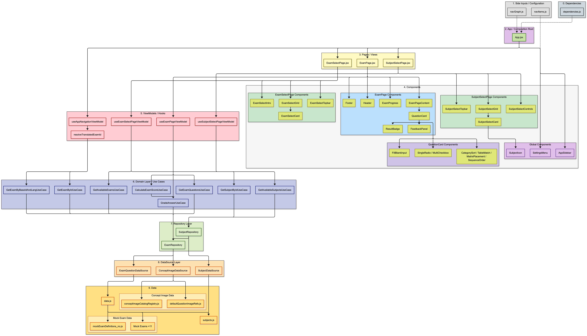

# Arkitektur

Prosjektet følger et lagdelt mønster inspirert av MVVM og Clean Architecture.




### Arkitekturflyt

```text
mockExam-filer / subjects.js
  ↓
datasources
  ↓
repositories
  ↓
use cases
  ↓
viewmodels
  ↓
pages
  ↓
UI components
```

---

## Lagdeling

| Lag | Filer | Ansvar |
|-----|-------|--------|
| **Data** | `src/data/data.js`, `src/data/subjects.js`, `src/data/exams/*.js` | Inneholder fagregister, eksamensregister og alle øveeksamener |
| **DataSource** | `ExamQuestionDataSource.js`, `SubjectDataSource.js` | Henter fag, eksamensdata og spørsmål fra lokal datakilde |
| **Repository** | `ExamRepository.js`, `SubjectRepository.js` | Gir domenelaget tilgang til fag, eksamener og spørsmål uten at domenet kjenner datakilden |
| **Domain / UseCases** | `GetAvailableSubjectsUseCase`, `GetSubjectByIdUseCase`, `GetAvailableExamsUseCase`, `GetExamByBaseIdAndLangUseCase`, `GetExamQuestionsUseCase`, `GradeAnswerUseCase`, `CalculateExamScoreUseCase` | Inneholder appens sentrale regler |
| **ViewModel** | `AppNavigationViewModel.js`, `ExamPageViewModel.js`, `ExamSelectPageViewModel.js`, `SubjectSelectPageViewModel.js` | Holder React-state, brukerens svar, leveringstilstand, timer, navigasjon, valgt fag/eksamen og score |
| **View / Page** | `ExamPage.jsx`, `ExamSelectPage.jsx`, `SubjectSelectPage.jsx` | Setter sammen sidene og sender props videre til komponentene |
| **Components** | `Header`, `QuestionCard`, `FeedbackPanel`, `Footer`, `SettingsMenu`, `Sidebar`, `ResultBadge` | Rene UI-komponenter som viser data og sender brukerhandlinger oppover |
| **i18n** | `LanguageContext.jsx`, `translations.js` | Håndterer språkvalg og tekstnøkler |
| **Theme** | `ThemeContext.jsx` | Håndterer light mode og dark mode |
| **Utils** | Lokale `Utils/`-mapper under relevante features, samt `src/utils/answer` | Hjelpefunksjoner ligger nær komponenten eller feature-området de brukes av. Kun funksjoner som brukes på tvers av flere lag ligger globalt i `src/utils/`. |
| **Constants** | `QuestionConfig.js`, `QuestionTypes.js` | Globale spørsmålsverdier og spørsmålstyper |
