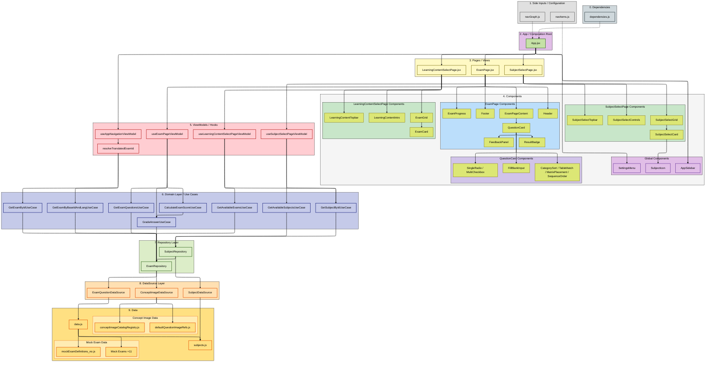

# Mermaid kode for arkitekturtegning

```mermaid
---
config:
  layout: elk
  elk:
    mergeEdges: true
    nodePlacementStrategy: NETWORK_SIMPLEX
  theme: base
  themeVariables:
    background: '#FFFFFF'
    mainBkg: '#FFFFFF'
    lineColor: '#111111'
    primaryBorderColor: '#111111'
    edgeLabelBackground: '#FFFFFF'
---
flowchart TB

%% =========================
%% DEPENDENCIES
%% =========================
subgraph Dependencies["0. Dependencies"]
    direction LR
        DI["dependencies.js"]
end

%% =========================
%% SIDE INPUTS / CONFIGURATION
%% =========================
subgraph SideInputs["1. Side Inputs / Configuration"]
    direction LR
        NavGraph["navGraph.js"]
        NavItems["navItems.js"]
end

%% =========================
%% APP LAYER
%% =========================
subgraph AppLayer["2. App / Composition Root"]
        App["App.jsx"]
end

%% =========================
%% PAGES
%% =========================
subgraph Pages["3. Pages / Views"]
    direction LR
        SubjectSelectPage["SubjectSelectPage.jsx"]
        LearningContentSelectPage["LearningContentSelectPage.jsx"]
        ExamPage["ExamPage.jsx"]
end

%% =========================
%% COMPONENTS
%% =========================
subgraph SubjectSelectComponents["SubjectSelectPage Components"]
    direction TB
        SubjectSelectTopbar["SubjectSelectTopbar"]
        SubjectSelectControls["SubjectSelectControls"]
        SubjectSelectGrid["SubjectSelectGrid"]
        SubjectSelectCard["SubjectSelectCard"]
end

subgraph ExamSelectComponents["LearningContentSelectPage Components"]
    direction TB
        LearningContentTopbar["LearningContentTopbar"]
        LearningContentIntro["LearningContentIntro"]
        ExamGrid["ExamGrid"]
        ExamCard["ExamCard"]
end

subgraph ExamPageComponents["ExamPage Components"]
    direction TB
        Header["Header"]
        ExamProgress["ExamProgress"]
        ExamPageContent["ExamPageContent"]
        QuestionCard["QuestionCard"]
        FeedbackPanel["FeedbackPanel"]
        ResultBadge["ResultBadge"]
        Footer["Footer"]
end

subgraph QuestionComponents["QuestionCard Components"]
    direction TB
        ChoiceQuestions["SingleRadio / MultiCheckbox"]
        FillBlank["FillBlankInput"]
        DragDropQuestions["CategorySort / TableMatch / MatrixPlacement / SequenceOrder"]
end

subgraph GlobalComponents["Global Components"]
    direction TB
        AppSidebar["AppSidebar"]
        SettingsMenu["SettingsMenu"]
        SubjectIcon["SubjectIcon"]
end

subgraph Components["4. Components"]
    direction LR
        SubjectSelectComponents
        ExamSelectComponents
        ExamPageComponents
        QuestionComponents
        GlobalComponents
end

%% =========================
%% VIEWMODELS
%% =========================
subgraph ViewModel["5. ViewModels / Hooks"]
    direction TB
        AppNavVM["useAppNavigationViewModel"]
        ResolveTranslated["resolveTranslatedExamId"]
        SubjectSelectVM["useSubjectSelectPageViewModel"]
        ExamSelectVM["useLearningContentSelectPageViewModel"]
        ExamPageVM["useExamPageViewModel"]
end

%% =========================
%% DOMAIN / USE CASES
%% =========================
subgraph Domain["6. Domain Layer / Use Cases"]
    direction TB
        GetAvailableSubjectsUC["GetAvailableSubjectsUseCase"]
        GetSubjectByIdUC["GetSubjectByIdUseCase"]
        GetAvailableExamsUC["GetAvailableExamsUseCase"]
        GetExamByIdUC["GetExamByIdUseCase"]
        GetExamByBaseIdAndLangUC["GetExamByBaseIdAndLangUseCase"]
        GetExamQuestionsUC["GetExamQuestionsUseCase"]
        GradeAnswerUC["GradeAnswerUseCase"]
        CalculateScoreUC["CalculateExamScoreUseCase"]
end

%% =========================
%% REPOSITORIES
%% =========================
subgraph RepositoryLayer["7. Repository Layer"]
    direction TB
        ExamRepo["ExamRepository"]
        SubjectRepo["SubjectRepository"]
end

%% =========================
%% DATASOURCES
%% =========================
subgraph DataSourceLayer["8. DataSource Layer"]
    direction TB
        ExamDS["ExamQuestionDataSource"]
        SubjectDS["SubjectDataSource"]
        ConceptImageDS["ConceptImageDataSource"]
end

%% =========================
%% DATA
%% =========================
subgraph MockData["Mock Exam Data"]
    direction LR
        MockDefinitions["mockExamDefinitions_no.js"]
        MockExams["Mock Exams ×11"]
end

subgraph ImageData["Concept Image Data"]
    direction LR
        ConceptImageRegistry["conceptImageCatalogRegistry.js"]
        DefaultImageRefs["defaultQuestionImageRefs.js"]
end

subgraph Data["9. Data"]
    direction TB
        DataRegistry["data.js"]
        SubjectsData["subjects.js"]
        MockData
        ImageData
end

%% =========================
%% DEPENDENCIES / CONFIG → APP
%% =========================
DI -.-> App
NavGraph -.-> App
NavItems -.-> AppSidebar

%% =========================
%% APP → PAGES / GLOBAL COMPONENTS
%% =========================
App --> SubjectSelectPage & LearningContentSelectPage & ExamPage & AppSidebar & SettingsMenu & AppNavVM

%% =========================
%% PAGES → COMPONENTS
%% =========================
SubjectSelectPage --> SubjectSelectTopbar & SubjectSelectControls & SubjectSelectGrid & SubjectSelectVM
SubjectSelectGrid --> SubjectSelectCard
SubjectSelectCard --> SubjectIcon

LearningContentSelectPage --> LearningContentTopbar & LearningContentIntro & ExamGrid & ExamSelectVM
ExamGrid --> ExamCard

ExamPage --> Header & ExamProgress & ExamPageContent & Footer & ExamPageVM
ExamPageContent --> QuestionCard
QuestionCard --> FeedbackPanel & ResultBadge & ChoiceQuestions & FillBlank & DragDropQuestions

%% =========================
%% VIEWMODELS → DOMAIN
%% =========================
AppNavVM --> ResolveTranslated

SubjectSelectVM --> GetAvailableSubjectsUC & GetSubjectByIdUC
ExamSelectVM --> GetAvailableExamsUC & GetSubjectByIdUC
ExamPageVM --> GetExamQuestionsUC & GradeAnswerUC & CalculateScoreUC

ResolveTranslated --> GetExamByIdUC & GetExamByBaseIdAndLangUC

%% =========================
%% DOMAIN → REPOSITORIES
%% =========================
GetAvailableSubjectsUC --> SubjectRepo
GetSubjectByIdUC --> SubjectRepo

GetAvailableExamsUC --> ExamRepo
GetExamByIdUC --> ExamRepo
GetExamByBaseIdAndLangUC --> ExamRepo
GetExamQuestionsUC --> ExamRepo

CalculateScoreUC --> GradeAnswerUC
GradeAnswerUC --> ExamRepo

%% =========================
%% REPOSITORIES → DATASOURCES
%% =========================
SubjectRepo --> SubjectDS
SubjectRepo --> ExamRepo

ExamRepo --> ExamDS
ExamRepo --> ConceptImageDS

%% =========================
%% DATASOURCES → DATA
%% =========================
SubjectDS --> SubjectsData

ExamDS --> DataRegistry
DataRegistry --> SubjectsData & MockDefinitions & MockExams

ConceptImageDS --> ConceptImageRegistry & DefaultImageRefs

%% =========================
%% NODE CLASSES
%% =========================
DI:::dependencyNode

NavGraph:::sideNode
NavItems:::sideNode

App:::appNode

SubjectSelectPage:::pageNode
LearningContentSelectPage:::pageNode
ExamPage:::pageNode

SubjectSelectTopbar:::componentNode
SubjectSelectControls:::componentNode
SubjectSelectGrid:::componentNode
SubjectSelectCard:::componentNode
LearningContentTopbar:::componentNode
LearningContentIntro:::componentNode
ExamGrid:::componentNode
ExamCard:::componentNode
Header:::componentNode
ExamProgress:::componentNode
ExamPageContent:::componentNode
QuestionCard:::componentNode
FeedbackPanel:::componentNode
ResultBadge:::componentNode
Footer:::componentNode
ChoiceQuestions:::componentNode
FillBlank:::componentNode
DragDropQuestions:::componentNode

AppSidebar:::globalNode
SettingsMenu:::globalNode
SubjectIcon:::globalNode

AppNavVM:::viewModelNode
ResolveTranslated:::viewModelNode
SubjectSelectVM:::viewModelNode
ExamSelectVM:::viewModelNode
ExamPageVM:::viewModelNode

GetAvailableSubjectsUC:::domainNode
GetSubjectByIdUC:::domainNode
GetAvailableExamsUC:::domainNode
GetExamByIdUC:::domainNode
GetExamByBaseIdAndLangUC:::domainNode
GetExamQuestionsUC:::domainNode
GradeAnswerUC:::domainNode
CalculateScoreUC:::domainNode

ExamRepo:::repositoryNode
SubjectRepo:::repositoryNode

ExamDS:::dataSourceNode
SubjectDS:::dataSourceNode
ConceptImageDS:::dataSourceNode

MockDefinitions:::dataNode
MockExams:::dataNode
ConceptImageRegistry:::dataNode
DefaultImageRefs:::dataNode
DataRegistry:::dataNode
SubjectsData:::dataNode

%% =========================
%% CLASS DEFINITIONS
%% =========================
classDef dependencyNode fill:#CFD8DC,stroke:#263238,stroke-width:1.8px,color:#000000
classDef sideNode fill:#E0E0E0,stroke:#424242,stroke-width:1.5px,color:#000000
classDef appNode fill:#C5E1A5,stroke:#33691E,stroke-width:2px,color:#000000
classDef pageNode fill:#FFF9C4,stroke:#827717,stroke-width:2px,color:#000000
classDef componentNode fill:#DCE775,stroke:#827717,stroke-width:1.5px,color:#000000
classDef globalNode fill:#E1BEE7,stroke:#4A148C,stroke-width:1.5px,color:#000000
classDef viewModelNode fill:#FFCDD2,stroke:#B71C1C,stroke-width:2px,color:#000000
classDef domainNode fill:#C5CAE9,stroke:#1A237E,stroke-width:2px,color:#000000
classDef repositoryNode fill:#DCEDC8,stroke:#33691E,stroke-width:2px,color:#000000
classDef dataSourceNode fill:#FFE0B2,stroke:#E65100,stroke-width:2px,color:#000000
classDef dataNode fill:#FFE082,stroke:#E65100,stroke-width:2px,color:#000000

%% =========================
%% SUBGRAPH STYLING
%% =========================
style Dependencies stroke:#000000,fill:#CFD8DC,color:#000000
style SideInputs stroke:#000000,fill:#E0E0E0,color:#000000
style AppLayer stroke:#000000,fill:#E1BEE7,color:#000000
style Pages stroke:#000000,fill:#FFF9C4,color:#000000
style Components stroke:#000000,fill:#F5F5F5,color:#000000
style SubjectSelectComponents stroke:#000000,fill:#C8E6C9,color:#000000
style ExamSelectComponents stroke:#000000,fill:#C8E6C9,color:#000000
style ExamPageComponents stroke:#000000,fill:#BBDEFB,color:#000000
style QuestionComponents stroke:#000000,fill:#D1C4E9,color:#000000
style GlobalComponents stroke:#000000,fill:#E1BEE7,color:#000000
style ViewModel stroke:#000000,fill:#FFCDD2,color:#000000
style Domain stroke:#000000,fill:#C5CAE9,color:#000000
style RepositoryLayer stroke:#000000,fill:#DCEDC8,color:#000000
style DataSourceLayer stroke:#000000,fill:#FFE0B2,color:#000000
style Data stroke:#000000,fill:#FFE082,color:#000000
style MockData stroke:#E65100,fill:#FFECB3,color:#000000
style ImageData stroke:#E65100,fill:#FFECB3,color:#000000

linkStyle default stroke:#111111,stroke-width:1.8px,color:#000000
```