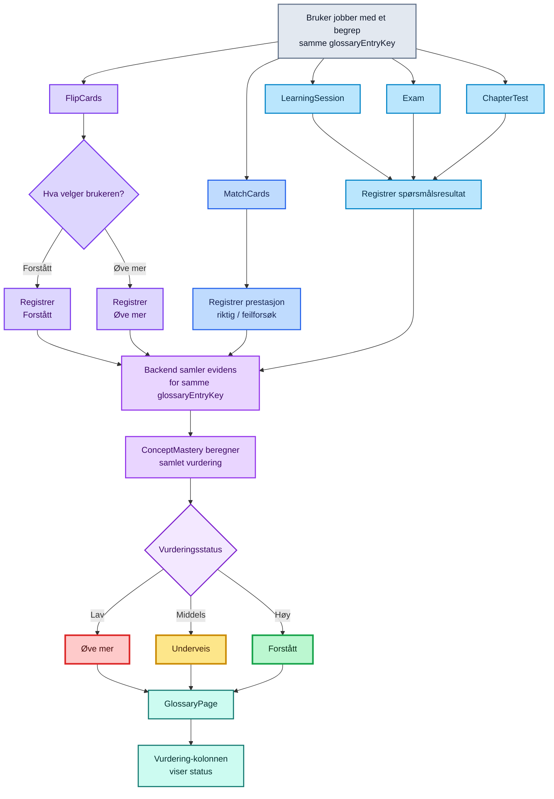

<a href="../../README.md">← Tilbake til README</a>

---

# Vurderingsalgoritmen

ExamPrepper bruker én vurderingsstatus per glossary-begrep. Frontend registrerer brukeraktivitet for samme `glossaryEntryKey`. Backend eier selve `ConceptMastery`-beregningen og returnerer statusen som GlossaryPage viser.

Frontend beregner ikke grensene for `Øve mer`, `Underveis` eller `Forstått`.

## Flyt



## Felles identitet

`glossaryEntryKey` er identiteten som kobler Glossary, FlipCards, MatchCards og backendens mastery-beregning sammen.

FlipCards bygger hvert kort fra ett glossary-entry. Kortets `id` er samme `glossaryEntryKey`. MatchCards bygger hvert par fra samme nøkkel og fører nøkkelen videre til begge slottene i paret.

Frontend trenger derfor ikke et eget mapping-register for vurdering.

## FlipCards

FlipCards er en eksplisitt vurderingshandling.

Når en innlogget bruker velger `Forstått`, sender `FlipcardsPageViewModel` assessment `understood` for kortets `glossaryEntryKey`. Når brukeren velger `Øve mer`, sendes `practice`.

Hver semantiske vurdering får en ny UUID fra `createConceptPracticeEventId()`. ID-en sendes sammen med assessmentet slik at backend kan behandle samme event idempotent.

Flyten er:

```text
FlipcardsPageViewModel
  ↓
RecordFlipcardAssessmentUseCase
  ↓
ConceptPracticeRepository
  ↓
ConceptPracticeDataSource
  ↓
POST /subjects/:subjectId/concept-practice/flipcards
```

Den lokale kortflyten beholdes. En signed-out bruker kan fortsatt bruke FlipCards, men det sendes ingen Concept Practice-write til backend.

## MatchCards

MatchCards registrerer observert prestasjon. Brukeren velger ikke mastery-status direkte.

Ved en feil match øker `wrongAttemptCount` for begge glossary-begrepene som inngikk i feilparet. Når et par senere matches riktig, lager `createSuccessfulMatchResult()` et resultat med:

```text
{
	glossaryEntryKey,
	wrongAttemptCount
}
```

`MatchCardsPageViewModel` sender ett resultat per `glossaryEntryKey` i den aktive sesjonen. En ny sesjon nullstiller dette lokale write-vernet. Hvert resultat får en ny event-ID før det sendes til backend.

Flyten er:

```text
MatchCardsPageViewModel
  ↓
RecordMatchCardResultUseCase
  ↓
ConceptPracticeRepository
  ↓
ConceptPracticeDataSource
  ↓
POST /subjects/:subjectId/concept-practice/match-cards
```

Signed-out brukere beholder den lokale MatchCards-opplevelsen uten Concept Practice-persistens.

## Hva frontend ikke eier

Frontend skal ikke kopiere mastery-policyen. Den skal ikke beregne scoregrenser, MatchCards-vekter, checkpoint-regler eller understood-gates.

GlossaryPage mottar backendens `mastery.status` gjennom den eksisterende glossary-flyten og lager bare presentasjon for statusen.

Den autoritative vurderingsalgoritmen ligger i backend. Backend-dokumentasjonen beskriver dagens terskler, checkpoint-regler og evidenskilder.

## Relevante filer

```text
src/model/datasource/ConceptPracticeDataSource.js
src/model/repositories/ConceptPracticeRepository.js
src/model/domain/mastery/RecordFlipcardAssessmentUseCase.js
src/model/domain/mastery/RecordMatchCardResultUseCase.js
src/ui/viewmodel/Shared/createConceptPracticeEventId.js
src/ui/viewmodel/FlipcardsPageViewModel.js
src/ui/viewmodel/MatchCardsPageViewModel.js
src/ui/viewmodel/MatchCardsPage/matchCardsSelectionTransitions.js
src/ui/viewmodel/MatchCardsPage/matchCardsResultModel.js
src/ui/viewmodel/GlossaryPage/glossaryMasteryModel.js
```
