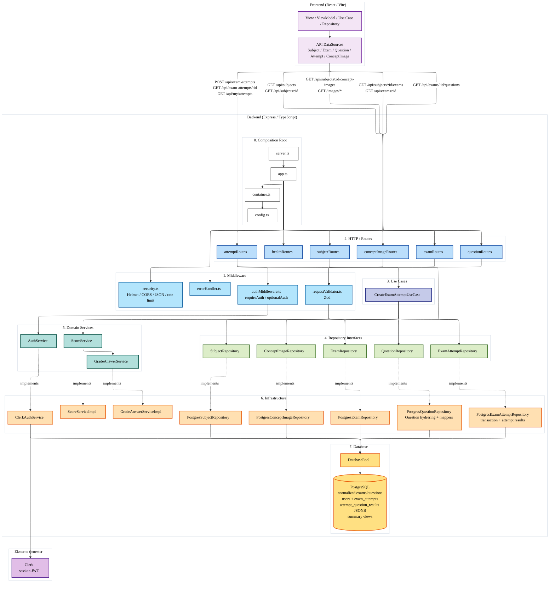
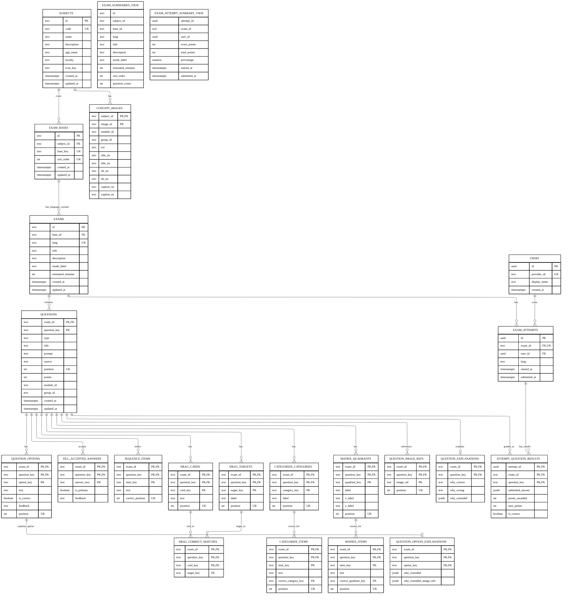

# BACKEND_ARCHITECTURE.md — ExamPrepper backendarkitektur

<!-- Sist oppdatert: 2026-06-10 -->

Dette dokumentet viser backend-arkitekturen slik den er etter Clerk-auth, attempt-historikk og konseptbilde-API.

Diagrammene er overordnede. De viser lag, ansvar og dataflyt. De viser ikke alle imports eller interne mapper-klasser.

## Backendflyt

## Databasemodell slik den er implementert nå

## Notater

- `question_image_refs.image_ref` er en tekstlig bildefreferanse i dagens migrasjon. Den er ikke en FK til `concept_images`.
- `concept_images` er implementert med sammensatt primærnøkkel på `subject_id` og `image_id`.
- `question_explanations` og `question_option_explanations` er en del av dagens database, selv om de ikke var med i eldre ER-diagrammer.
- Attempts lagres som metadata i `exam_attempts` og ett resultat per spørsmål i `attempt_question_results`.
